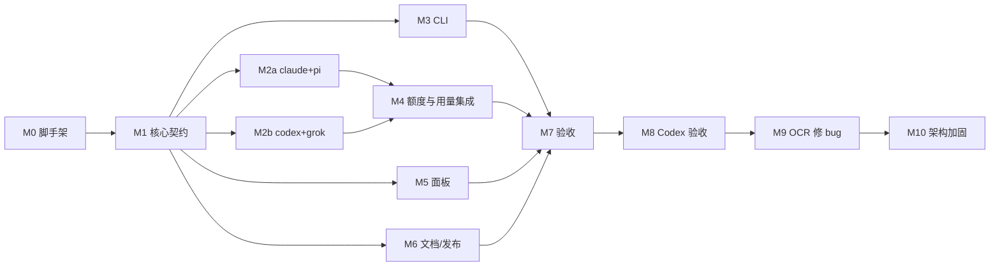

# sideby v0.1 实施计划

日期：2026-10-05 · 对应 spec：`docs/specs/2026-10-05-sideby-v0.1-design.md` · 状态：已按 Codex 审核修订（见文末）

## 编排

- **主 agent**：负责 M0、M1 的全部契约代码，所有集成，以及 M7 之后的验收、审查和加固。
- **subagent**：M1 合入后，并行做 M2a、M2b、M5、M6。每个 subagent 只写自己目录下的文件，并且必须跑通 `pnpm check` 才能交回。主 agent 逐个复核后合入。
- **共享文件**：`src/types.ts`、`src/core/**`、`package.json` 只由主 agent 改。subagent 需要改契约时，在交付说明里提出，由主 agent 决定。

估时按 agent 执行速度：每轮工具调用（读、改、跑验证、修）约 3 分钟。

## M0 脚手架（主 agent，约 8 轮）

文件：
- `package.json`
  - 设 `type: module`，`engines.node >=22.18`，`bin.sideby -> dist/cli/main.js`。
  - `exports` 指向 `.`（库）和 `./testing`。
  - `files` 包含 `dist`、`schemas`、`skills`、README、LICENSE。
  - scripts：`build`、`check`、`test`、`lint`、`typecheck`、`leak-check`、`schemas`。
- `tsconfig.json`：开 `strict`、`rewriteRelativeImportExtensions`、`allowImportingTsExtensions` 加 `noEmit`（只做 typecheck）。另建 `tsconfig.build.json`，输出到 `dist`，排除测试。
- `biome.json`
- `.gitignore`：忽略 `node_modules`、`dist`、`.review-handoff`。
- `LICENSE`（MIT）
- `scripts/leak-check.sh`：参照维护者另一个项目的同名脚本，把私有文件名单换成 sideby 的。
- `testing/index.ts`：
  - `withFakeHome(fn)`：建临时 HOME，设好 `HOME`、`XDG_*`，结束时清理。真实 HOME 泄漏进测试时直接失败。
  - `fakeHost(name, behaviour)`：在临时 PATH 里放一个假宿主可执行文件，记录它收到的 argv 和 env，再按要求的退出码或信号退出。
- `.github/workflows/ci.yml`

验证：`pnpm install`、`pnpm check` 都能跑通（此时还没有业务测试）。

## M1 核心契约（主 agent，约 30 轮）

| 文件 | 内容 | 测试 |
|---|---|---|
| `src/types.ts` | `Plugin`、`PluginApi`、`FamilyDef`、`SharedItemDef`、`ShareMode`、`Account`、`Finding`、`FixResult`、`QuotaWindow`、`QuotaReport`、`UsageReport`、`HookContext` | 由 typecheck 保证 |
| `src/core/paths.ts` | HOME、XDG 配置和状态目录、`~` 展开 | `paths.test.ts` |
| `src/core/fs-safe.ts` | 原子写（临时文件、rename、mode）；递归复制（保留 mode、隐藏文件和 symlink）；内容比较；带 hash 的条件写入 | `fs-safe.test.ts` |
| `src/core/config.ts` | 用 TypeBox 定义并校验 config；不存在时用默认值 | `config.test.ts` |
| `src/core/accounts.ts` | 按家族的 FamilyDef 发现账号；处理名字规则和 `ignore`；解析 `<family>:<name>` 和唯一短名；歧义时报错并列出候选 | `accounts.test.ts` |
| `src/core/secret-file.ts` | dotenv 子集解析器；校验权限 600；错误只报行号 | `secret-file.test.ts` |
| `src/core/share-modes.ts` | 每种 Mode 的 `check(item, account) -> Finding` 和 `fix()` | `share-modes.test.ts`，覆盖 spec §3.3 每一格，并逐条对应旧 zsh 测试 §2–§7 |
| `src/core/doctor.ts` | 遍历账号：共享项、凭据权限、备份残留、像备份的名字，再加插件的 `doctor.check`；汇总 Finding；`--fix` 和 `--force` | `doctor.test.ts` |
| `src/core/create.ts` | `new`：校验名字，确认主目录存在、目标不存在；铺共享项；API 账号写 600 的 `proxy.env` 模板；触发 `account.created` | `create.test.ts` |
| `src/core/launch.ts` | 按 spec §3.5 构造 env 和 args；`spawn`；处理信号和退出码 | `launch.test.ts`，用 fakeHost 覆盖退出码、信号、env 隔离、钩子中止 |
| `src/plugins/loader.ts` | 发现插件目录；所有权和权限校验；`import()`；冲突检测；加载错误收集 | `loader.test.ts` |
| `src/plugins/bus.ts` | 注册和派发事件；按家族过滤；超时；错误标注插件名 | `bus.test.ts` |
| `src/plugins/account-script.ts` | 内置可选插件 | `account-script.test.ts` |
| `src/runtime.ts` | `createRuntime({ env })`：加载 config 和插件，返回 families、accounts、doctor、launch 等服务，供 CLI 和面板共用 | 集成测试 |

验收：`pnpm check` 通过；把维护者旧脚本测试的场景逐条对应到新测试名（对照表留在维护者本机，不入库）。cursor 那一组（§10）标「v0.2」。

## M2a claude 加 pi 家族（subagent A，约 20 轮）

- `src/families/claude/index.ts`：FamilyDef（spec §3.4）；`readUsage` 读 `projects/**/*.jsonl`，按 `message.id` 去重，统计近 7 天的 input、output、cache tokens。
- `src/quota/claude-statusline.ts`：`setup`（返回 diff，确认后执行）、`teardown`（hash 保护）、`tap` 入口 `src/quota/statusline-tap.ts`（只 import fs 和 path）。
- `src/families/pi/index.ts`：FamilyDef，Main 账号是 `~/.pi/agent`，其他账号是 `~/.pi-<name>/agent`。
- 测试：用 fixture 测 jsonl（含重复行、坏行）；setup、teardown 的冲突和逐字节还原；tap 透传 stdout 和退出码，解析失败时也透传。

## M2b codex 加 grok 家族（subagent B，约 18 轮）

- `src/families/codex/index.ts`：FamilyDef；非 main 账号加 file-store 参数（用户参数里已有就不加）；`readQuota` 读 rollout（spec §3.7 的规则）；`readUsage` 取每个文件最后一条 `total_token_usage`，统计近 7 天。
- `src/families/grok/index.ts`：FamilyDef，包含 copy 和 local 项，以及 `auth.json` 是 symlink 时报 fail。
- 测试：rollout fixture 覆盖多文件、乱序、截断、坏行、`secondary` 为 null、未知窗口长度；Grok 的 copy 修复不写穿到主目录。

## M3 CLI（主 agent，约 15 轮）

- `src/cli/main.ts`：手写参数解析，不引入依赖。子命令放在 `src/cli/commands/*.ts`。
- 每个命令同时支持人读输出和 `--json`；人读输出用颜色，`NO_COLOR` 时关闭。
- `src/cli/schemas.ts` 生成 `schemas/*.json`，由 `pnpm schemas` 调用。CI 检查生成结果和仓库里的版本一致。
- `shell-init` 为 zsh 和 bash 输出函数。
- 启动时检查 Node 版本。
- 测试：在子进程里真实执行 `node src/cli/main.ts …`，配合假 HOME 跑通 spec §5 的 1–6、11、12。

## M4 额度与用量集成（主 agent，约 8 轮）

- `src/quota/index.ts`：按账号汇总 `readQuota`、`readUsage` 和 statusline 缓存，生成 `QuotaReport`。没有数据时区分三种原因。
- `sideby quota` 命令和面板共用这一层。

## M5 面板（subagent C，约 25 轮）

- `src/panel/handler.ts`：实现 `createPanelHandler`，包括路由、Host、Origin、token 校验，请求体上限，写操作锁。
- `src/panel/page.ts`：导出内联的 HTML、CSS、JS 字符串，注入 token 和 basePath。
- API：
  - `GET /api/state`：账号、额度、用量、健康状态。
  - `POST /api/doctor`、`POST /api/fix`、`POST /api/accounts`（新建）。
  - `POST /api/quota/claude/setup`：先返回 diff，第二次带确认参数才执行。
- `src/cli/commands/ui.ts`：监听、端口顺延、探测已有面板、打开浏览器。
- 测试：handler 的单元测试覆盖 spec §5 第 10 条；用 `node:http` 起服务的集成测试。
- 验收截图：用 ego-browser 打开面板，截取四种状态，存到 `docs/verification/panel/`。

## M6 文档与发布（subagent D，约 12 轮）

- `README.md`（英文）、`README.zh-CN.md`：首屏放标语、面板截图（M7 后补）、一行安装命令，再写三步上手、对比表（cc-switch、magpie、aimux）、FAQ（条款、插件安全）。
- `AGENTS.md`、`CLAUDE.md`（软链接到 AGENTS.md）、`llms.txt`、`skills/sideby/SKILL.md`。
- `docs/release.md`：首发清单（spec §3.12）。
- `.github/workflows/release.yml`：按 spec §3.12，action 固定到 SHA。
- `.github/dependabot.yml`：更新 github-actions。
- 验证：用 actionlint 检查 workflow（本机有就跑，没有就标 `UNVERIFIED`）；`npm pack --dry-run` 的文件列表符合预期。

## M7 自测验收（主 agent，约 20 轮）

1. `pnpm check`、`pnpm build`。
2. 用 `npm pack` 打包，在临时目录里安装 tarball 并运行，确认 `dist` 能跑、没有 `.ts` 残留。
3. 逐条跑 spec §5 的 1–12，结果写进 `docs/verification/2026-10-v0.1.md`。
4. 在真实 HOME 上只读运行 `sideby list --json`、`sideby doctor --json`、`sideby quota --json`，与维护者旧脚本的输出对照。
5. 实测 statusline-tap 的耗时（跑 20 次取中位数）。
6. 回填 README 截图。

## M8 Codex 验收（约 6 轮）

把 spec、plan、verification 文档和 diff 交给 Codex 做只读验收。主 agent 逐条核实它的发现，确认属实的就修复，再跑一次 M7 的确定性部分。

## M9 open-code-review-delegate（约 10 轮）

按技能流程跑一轮 OCR 审查，修复核实属实的 bug，每个修复都配回归测试。

## M10 architecture-hardening-loop（约 15 轮）

按技能流程迭代，直到没有有证据支撑的架构修复项为止。

## 不做（本轮）

推送、建 GitHub 仓、npm 发布、维护者本机迁移、cursor 家族。

## 审核修订（2026-10-05 Codex 只读咨询）

| 意见 | 改动 |
|---|---|
| Blocker：面板依赖未冻结的运行时契约 | M1 结束前冻结 `src/runtime.ts` 的 `Runtime` 接口，包括 accounts、doctor、fix、create、quota、usage。M4 的汇总接口在 M1 里先写好签名并给出可用实现。M5 在这些冻结之后才开始。 |
| Blocker：嵌入场景下 token、Host、Origin 未定 | spec §3.8 已改为 `allowedHosts`、实例 token、同源 Origin。M5 增加独立运行和嵌入门户两个集成测试。 |
| Blocker：信号测试不够真实 | M1 的 `launch.test.ts` 增加真实进程组测试：用 `detached` 起 `sideby run`，分别向进程组和只向 sideby 发 SIGINT、SIGTERM；断言转发次数、退出码，以及子进程退出后不再转发。 |
| Major：验收缺逐条映射 | M7 先写 `docs/verification/2026-10-v0.1.md`，列出 §5 每一条对应的测试名、真实操作、产物路径；缺一项就不能算通过。 |
| Major：「绝不做」规则的断言不够硬 | 每个用例在 `--fix` 前后比较主目录 hash、symlink 目标和凭据文件 hash。 |
| Major：`account-script` 的启用和信任 | 由 `config.plugins['account-script'].enabled` 启用；复用插件的所有权和权限校验；测试覆盖组可写、超时、stderr 截断和宿主未启动。 |
| Major：首发流程细节 | `docs/release.md` 写明：npm 登录（必须开 2FA）、包名占用检查、`npm pack --dry-run` 检查清单、首发失败怎么处理、trusted publisher 配置步骤。workflow 用 actionlint 检查。 |
| Minor：共享测试工具 | `testing/` 和契约在 M1 冻结；subagent 只新增自己目录下的文件。 |
| Minor：tarball 测试 | M7 增加一个最小的外部使用方：从 tarball 安装，import 库入口和 `sideby/testing`，加载包外的 `.ts` 插件；检查 `npm pack --json` 的文件清单里没有 `.ts` 源码。 |
| Minor：写路径审计 | 集成测试在操作前后给假宿主目录拍快照，断言除了确认过的 `settings.json`，没有任何写入。 |

## 风险与回退

- **subagent 交回的代码不符合契约**：主 agent 退回并说明原因，最多返工两次；还不行就自己写。
- **ego-browser 不可用**：改用 agent-browser 截图，并在 verification 里注明。
- **某条验收只能靠真人完成**（例如两个真实订阅号同时登录）：标 `UNVERIFIED`，写明原因和补验方法。
