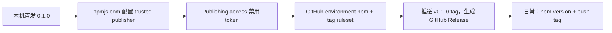

# 发布流程

sideby 用 npm trusted publishing 发布：GitHub Actions 用 OIDC 换一个短期凭据，自动附带 provenance（来源证明），仓库里不存任何长期 npm token。

npm 要求包已经存在才能配置 trusted publisher，所以 0.1.0 只能在本机手动发一次，之后全部走 tag。



## 一、首发（只做一次，作者确认后再做）

### 1. 准备

1. 用 `npm login` 登录 npm，并确认开了 2FA：

   ```sh
   npm whoami
   npm profile get                      # two-factor auth 一行应为 auth-and-writes
   npm profile enable-2fa auth-and-writes   # 还没开就执行这条
   ```

2. 确认包名没被占用。返回 `E404` 才能继续；有返回内容说明已被占用，需要先改 spec 里的包名再继续：

   ```sh
   npm view sideby
   ```

3. 确认 GitHub 仓库 `Adonis0123/sideby` 已建好、`main` 已推送，本地工作树干净，`package.json` 的 `version` 是 `0.1.0`：

   ```sh
   git status --short          # 应无输出
   node -p "require('./package.json').version"
   ```

### 2. 检查与构建

```sh
pnpm install --frozen-lockfile
pnpm check
pnpm build
```

### 3. 核对发布清单

```sh
npm pack --dry-run
```

逐项核对输出的文件列表：

- 只有 `dist/`、`schemas/`、`skills/`、`README.md`、`README.zh-CN.md`、`LICENSE`、`package.json`。
- `dist/` 里只有 `.js` 和 `.d.ts`，没有 `.ts` 源码，没有 `*.test.*`、`fixtures/`。
- 没有 `.env`、`proxy.env`、`auth.json`、`.review-handoff/` 之类的文件。

也可以用命令查 `.ts` 源码（输出 `[]` 才对）：

```sh
npm pack --dry-run --json | node -e 'const [p] = JSON.parse(require("fs").readFileSync(0, "utf8")); console.log(p.files.map((f) => f.path).filter((x) => x.endsWith(".ts") && !x.endsWith(".d.ts")))'
```

### 4. 发布

```sh
npm publish --access public    # 按提示输入 2FA 一次性密码
npm view sideby version        # 应为 0.1.0
```

本机首发没有 provenance，这是正常的；之后 CI 发的版本才有。

### 5. 首发失败怎么办

| 现象 | 原因 | 处理 |
|---|---|---|
| `E403`，提示包名和已有包太像，或没有权限 | 包名被占用或被 npm 判为近似名 | 不要换个名字直接发；先改 spec 和 `package.json`，再从第 1 步重来 |
| `E402 Payment Required` | 漏了 `--access public` | 加上参数重发 |
| `EOTP` 或一次性密码错误 | 2FA 密码过期 | 等下一个密码，重新执行 `npm publish` |
| 网络中断，不确定有没有发出去 | — | 先跑 `npm view sideby versions`；已经有 0.1.0 就不要重发 |
| 发出去了，但内容有问题 | — | 不要 unpublish；按下面「回滚」处理，然后发 0.1.1 |

### 6. 在 npmjs.com 配置 trusted publisher

打开 npmjs.com 上 `sideby` 包的 **Settings**：

1. **Trusted Publisher** 选 **GitHub Actions**，填：
   - Organization or user：`Adonis0123`
   - Repository：`sideby`
   - Workflow filename：`release.yml`
   - Environment name：`npm`
2. **Publishing access** 选 **Require two-factor authentication and disallow tokens**。这样任何 token 都发不了包，只剩 trusted publishing 和本人带 2FA 的手动操作。
3. 保存后，如果本机或其他地方还有为 sideby 建的 automation token 或 granular token，在 **Access Tokens** 里删掉。

### 7. 在 GitHub 配置仓库

在 `Adonis0123/sideby` 的 **Settings** 里：

1. **Environments** → 新建 `npm`：
   - **Deployment branches and tags** 选 **Selected branches and tags**，添加一条 **Tag** 规则，模式 `v*`。这样只有 `v*` tag 触发的 job 能用这个 environment。
   - 可选：**Required reviewers** 加上自己，每次发布前在 Actions 页面点一次批准。
2. **Rules → Rulesets** → **New tag ruleset**：
   - Target：包含模式 `v*`。
   - 规则：勾选 Restrict creations、Restrict updates、Restrict deletions、Block force pushes。
   - Bypass list：只加 Repository admin。
   - Enforcement status：Active。
3. **Actions → General → Workflow permissions** 选 **Read repository contents and packages permissions**，不勾选允许 Actions 创建和批准 PR。
4. **Advanced Security**（旧名 Code security）里开启 **Dependabot alerts** 和 **Dependabot security updates**。版本更新由仓库里的 `.github/dependabot.yml` 负责，每周检查 GitHub Actions 和 npm 依赖。

### 8. 补 0.1.0 的 tag 和 GitHub Release

```sh
git tag v0.1.0
git push origin v0.1.0
```

`release.yml` 会跑完检查和构建，发现 `sideby@0.1.0` 已经在 npm 上，就跳过 `npm publish`，接着由 `github-release` job 生成 GitHub Release。这一步也顺带验证了 environment、OIDC 和 tag ruleset 的配置。

## 二、日常发版

前提：在 `main` 上，工作树干净，最新一次 CI 是绿的。

```sh
git switch main
git pull --ff-only
npm version patch -m "🔖 chore(release): v%s"   # 新功能用 minor
git push --follow-tags
```

`npm version` 会改 `package.json` 的版本号，提交一次，并打上 `v<版本号>` tag。推送后 `release.yml` 依次执行：

1. `publish` job（environment `npm`，权限 `contents: read` 加 `id-token: write`，不用任何缓存）：
   - 升级到最新 npm，并确认版本不低于 11.5.1。
   - `pnpm install --frozen-lockfile --ignore-scripts`。
   - 确认 tag 等于 `v` 加 `package.json` 里的版本号，不一致就失败。
   - `pnpm check`、`pnpm build`，然后 `npm publish --access public`。provenance 由 trusted publishing 自动生成，不传 token。
2. `github-release` job（权限 `contents: write`）：用 changelogithub 按 emoji 前缀的 commit 生成发布说明。

发完检查：

```sh
npm view sideby version
npm view sideby dist.attestations    # 有内容说明 provenance 已生成
```

npmjs.com 的包页面上也应该能看到 provenance 标记。

### 发版失败怎么办

| 现象 | 处理 |
|---|---|
| tag 和版本号不一致 | 删掉这个 tag（`git tag -d vX.Y.Z`，远端删除需要 admin 绕过 ruleset），修好版本号后用 `npm version` 重新打 tag |
| `npm publish` 报 OIDC 或 `E404`/`E403` | 对照第 6、7 步检查 trusted publisher 的仓库名、workflow 文件名、environment 名是否完全一致 |
| `pnpm check` 失败 | 修好代码后发一个新的 patch 版本，不要移动已有的 tag |
| npm 已发出，GitHub Release 失败 | 在 Actions 页面重跑失败的 job；`publish` 会因版本已存在而跳过发布 |

## 三、回滚

不用 `npm unpublish`。撤回会让依赖这个版本的人安装失败，而且同一个版本号以后再也不能用。

```sh
npm deprecate sideby@0.1.3 "Broken: <一句话原因>. Use 0.1.4 or later."
```

然后修复问题，按日常流程发下一个 patch 版本。如果需要让 `latest` 暂时指回旧版本：

```sh
npm dist-tag add sideby@0.1.2 latest
```

这两条命令都在本机执行，需要 2FA。

## 四、规则

- 除首发外，不在本机执行 `npm publish`。
- 不创建长期 npm token，不在 workflow 里用 `pull_request_target`。
- workflow 里的 action 全部固定到完整 commit SHA，行尾注释版本号。Dependabot 升级 action 时会一起更新 SHA 和注释。
