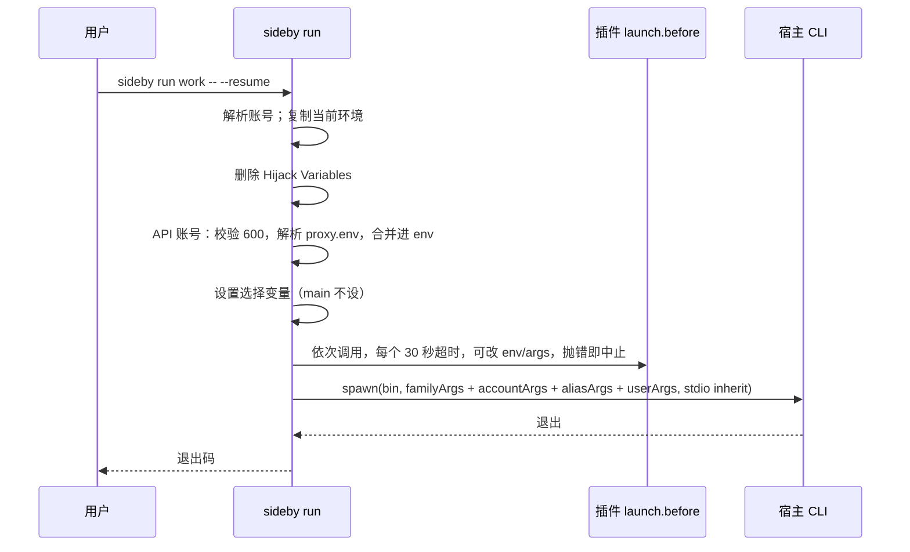
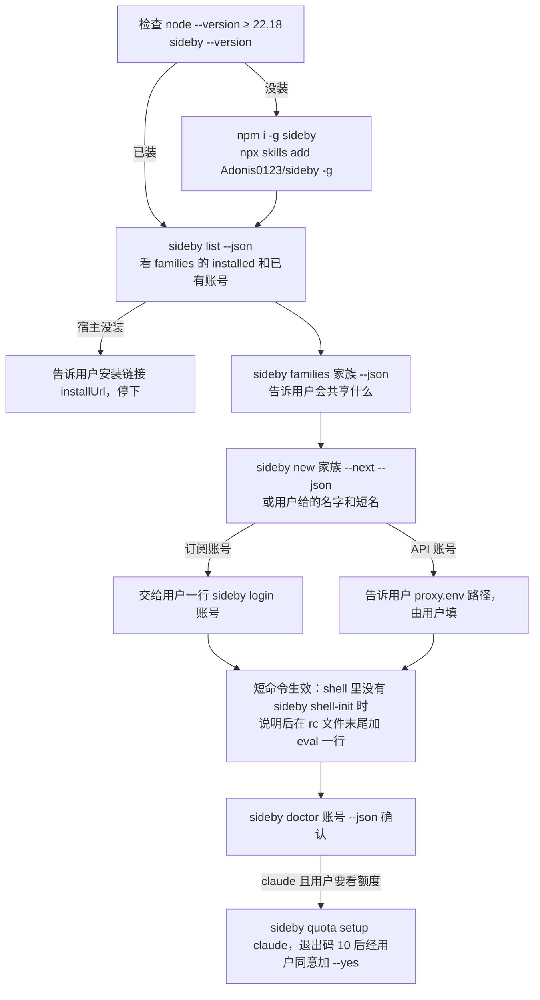

# sideby v0.1 设计

日期：2026-10-05 · 状态：已按 Codex 审核修订（§9） · 术语见 `CONTEXT.md` · 决策见 `docs/adr/`

## 1 目标

让同时持有多个 AI coding 账号的人，在终端里把它们**并排**跑起来，做到四点：不串号；skills、hooks、规则只维护一份；坏了一条命令修好；每个账号的额度和用量一屏看完。

一句话定位：**Run every AI coding account side by side.**

### 1.1 用户与场景

| 用户 | 典型账号组合 | 今天的痛点（证据） |
|---|---|---|
| cc-switch / magpie 用户，想同时开多个账号 | 1 个 Claude 订阅 + DeepSeek/GLM key + 中转 | 切换会改全局配置，同一时间只有一个生效（cc-switch #1105、#1106、#2908） |
| 工作号和个人号分开用 | 2 个 Claude 订阅、2 个 ChatGPT 号 | 手工维护 `CLAUDE_CONFIG_DIR` 和 symlink，时间一长就漂移 |
| 多个 CLI 一起用 | Claude Code + Codex + Grok + pi | 每家的目录约定和坑都不一样 |

### 1.2 体验原则

- **什么都不用额外装。** 只要有 Node 和宿主 CLI 就能用。用量由 sideby 直接读宿主的本地记录。
- **没有数据时要说清楚原因。** 是「还没开过会话」「这个宿主没有公开来源」，还是「格式变了」，每种情况分开提示。
- **每条错误都告诉用户下一步怎么做。** 错误信息里只出现路径和变量名，永不出现凭据的值。

### 1.3 成功标准

- 只装了 `~/.claude` 的新用户，从 `npx sideby` 开始，3 条命令以内让第二个账号并排跑起来。
- 维护者原有的自制多账号脚本，其全部行为在 sideby 里都有对应测试（对照表留在维护者本机，不入库）。
- README 首图是面板截图，显示多个账号的额度。

## 2 范围

### 2.1 v0.1 做

- 四个内置家族：claude、codex、grok、pi，全部以插件形式实现。
- CLI：`list`、`run`、`new`、`login`、`doctor`、`quota`、`ui`、`shell-init`、`plugins`、`quota setup|teardown claude`。
- 本地插件：Family Plugin，以及 `launch.before`、`account.create.before`、`account.created`、`doctor.check` 四类 Hook。
- 面板：账号卡片（额度、用量、健康）、体检加一键修复、新建账号。由 `createPanelHandler` 提供，`sideby ui` 独立运行。
- 额度：Claude 订阅读 statusline 缓存，Codex 读本地 rollout。
- 用量：内置读取 Claude 和 Codex 的本地会话记录，不依赖任何外部工具。
- AI 配套：`AGENTS.md`、`CLAUDE.md` 链接、`--json` 加 JSON Schema、可安装 skill、`llms.txt`。
- 发布：CI 加 tag 触发的 trusted publishing workflow（就绪，但本轮不推送、不发布）。
- 平台：macOS、Linux。

### 2.2 v0.1 不做

| 不做 | 原因 | 何时再议 |
|---|---|---|
| 全局切换、订阅轮换、凭据代理 | ADR-0001 | 不再议 |
| 调用逆向额度接口 | ADR-0003 | 第三方插件可以自行实现 |
| Grok、pi 的额度和用量 | 没有公开或稳定的本地来源 | 宿主提供来源后 |
| cursor 家族 | 只有一个 file-store 槽位，同时用多个号可能被封 | v0.2 |
| 面板里「在终端打开」 | 每种终端的做法不同 | v0.2 |
| 从 npm 安装插件 | 等于运行第三方代码 | 有真实需求再议 |
| 单文件二进制、Homebrew tap | ADR-0002 第二阶段 | Node 成为门槛时 |
| Windows、MCP server、定时体检 | 见 ADR 和 grilling 记录 | 不计划，或 v0.2 再议 |

## 3 架构

### 3.1 仓库与构建

```
sideby/
├── AGENTS.md · CLAUDE.md（内容为 `@AGENTS.md`）· CONTEXT.md · README.md · README.zh-CN.md · llms.txt
├── docs/{adr,specs,plans,verification}/
├── schemas/                  # 由 TypeBox 定义生成的 JSON Schema
├── skills/sideby/SKILL.md
├── src/
│   ├── cli/                  # 参数解析和各子命令（只做 I/O）
│   ├── core/                 # 路径、配置、账号发现、Secret File、Share Mode、doctor、launch、原子写入
│   ├── plugins/              # 加载器、信任校验、事件总线
│   ├── families/{claude,codex,grok,pi}/
│   ├── quota/                # Claude statusline 缓存，Codex rollout 读取
│   ├── panel/                # createPanelHandler 和内联页面
│   └── index.ts              # 库入口：createPanelHandler 和插件类型
├── testing/                  # 假 HOME、假宿主 bin、插件测试工具
├── .github/workflows/{ci,release}.yml
└── scripts/leak-check.sh
```

- **构建**：源码是 `.ts`，用 `tsc` 编译到 `dist/`，开启 `rewriteRelativeImportExtensions`。原因是 Node 拒绝对 `node_modules` 里的 `.ts` 做类型剥离（本机 Node 22.22.3 实测报 `ERR_UNSUPPORTED_NODE_MODULES_TYPE_STRIPPING`）。用户的插件在 `node_modules` 之外，可以直接写 `.ts`。
- **开发和测试**：直接用 `node --test` 跑 `.ts`，不需要先构建。
- **依赖**：运行时只有 `typebox`；开发时有 `typescript`、`@biomejs/biome`、`@types/node`。
- **启动检查**：Node 低于 22.18 时，打印升级提示并以 1 退出。`--help` 和 `--version` 也走这个检查。`package.json` 的 `engines.node` 只让 npm 打出 `EBADENGINE` 警告，拦人的是这里。`statusline-tap` 除外：Claude Code 每次刷新 status line 都会调用它，版本不够时也必须继续执行原来的命令，不能把这次刷新丢掉。

### 3.2 账号模型

| 家族 | Main Account | 其他 Account | 选择变量 | 宿主命令 |
|---|---|---|---|---|
| claude | `~/.claude` | `~/.claude-<name>` | `CLAUDE_CONFIG_DIR` | `claude` |
| codex | `~/.codex` | `~/.codex-<name>` | `CODEX_HOME` | `codex` |
| grok | `~/.grok` | `~/.grok-<name>` | `GROK_HOME` | `grok` |
| pi | `~/.pi/agent` | `~/.pi-<name>/agent` | `PI_CODING_AGENT_DIR` | `pi` |

- 账号名 `<name>` 必须匹配 `^[a-z0-9][a-z0-9-]{0,31}$`。现有的 `004` 本身就是合法名字。
- 账号靠通配发现。不符合命名规则的目录、config 里 `ignore` 的目录，以及非目录项，都不算账号。
- 名字符合规则的目录，还必须满足以下之一才算账号：有 `proxy.env`；至少有一个该家族的共享项；或者是空目录（刚建好）。这样能排除别的工具的配置目录，例如 claude-code-router 的 `~/.claude-code-router`。名字看起来像备份（含 `bak`、`backup`、`old`、`tmp`）时，doctor 给一条 warn，建议加进 `ignore`。
- Main Account 的名字固定为 `main`，启动时不设选择变量。不做「某个编号就是主目录」这类特殊映射；需要旧习惯的用户用 config 的 `aliases`（例如 `codex001 → codex:main`）。
- **引用账号**：写 `<family>:<name>`。名字在所有家族里唯一时，可以只写 `<name>`；有歧义就报错，并列出候选。

**API 账号**：账号目录里有 `proxy.env`。

- 解析规则是 dotenv 子集：`KEY=VALUE`、可选的 `export ` 前缀、单引号或双引号、`#` 注释。不经过 shell，所以不支持命令替换。`$NAME` 和 `${NAME}`（不加引号或双引号里）只展开同一文件前面已定义的变量，以及 `HOME`、`USER`、`LOGNAME`、`TMPDIR`、`XDG_*_HOME` 这几个不含凭据的位置变量；其他环境变量一律不读，找不到就报错并给出行号。单引号里原样保留。
- 解析出错时报出行号，不报内容。权限不是 600 时拒绝启动，并提示 `chmod 600 <path>`。

### 3.3 Share Mode

| Mode | 健康 | `--fix` | 绝不做 |
|---|---|---|---|
| `link` | 是 symlink，解析后指向主目录对应项 | 缺失时补 link | 位置上是真文件或真目录时，只报告，并给出 `mv <x> <x>.local && ln -s …` |
| `copy` | 是真文件或真目录，内容与主目录一致 | 缺失或过期时复制；是指向主目录的 symlink 时，先删 link 再复制 | 永远不通过 symlink 写到主目录；类型不一致时不动 |
| `link-or-copy` | symlink，或内容一致的副本 | 副本过期时镜像主目录 | 主目录为空或类型不一致时不动 |
| `link-or-local` | symlink，或任意真文件 | 缺失时补 link | 不比较内容，不覆盖 |
| `local` | 是真文件，不比较内容 | 缺失时从主目录复制一份 | 是 symlink 时只报告 |
| `local-if-api` | 订阅账号按 `link-or-copy` 判断；API 账号必须是自己的真文件 | 只修订阅账号 | API 账号的 symlink 或缺失，只报告 |
| `info` | 不计数 | 不处理 | — |
| `json-key` | 账号自己文件里的某个 JSON 键，与主文件一致 | 只替换这一个键；写入前后比较文件 hash，期间文件被改动就放弃 | 会让账号已有条目减少（包括清空）时，没有 `--force` 就拒绝；文件是 symlink、不是 JSON 对象、该键不是对象时，`--force` 也拒绝 |

通用规则（与旧实现一致，逐条有测试）：

- 主目录里没有的项：没什么可共享，不报告、不计入分母、不自动创建（2026-10-05 面板验收后调整：多数用户没有 `commands`、`themes` 这类目录，报 warn 只是噪音）。
- symlink 永不改指向，分三种情况：
  - 悬空链接：报 fail。
  - 指向别处但目标存在：允许链接的项报 warn（用户有意为之）；宿主不允许链接的项（`copy`、`local`、`noSymlink`）报 fail。
  - 相对路径的链接只要解析后等价，就算健康。
- 共享项路径必须是相对路径，不能含 `..`。每次修复在执行的那一刻都会校验写入位置：解析父目录的真实路径后，必须仍在账号目录内，父目录是指向别处的链接时拒绝。
- 复制时递归处理，保留权限位和隐藏文件，目录里的 symlink 原样复制为 symlink。
- 所有写入先写同目录的临时文件（权限 600），再 rename；凭据文件写完后 chmod 600。
- 条件写入（`json-key`、statusline teardown）会在写入前、以及 rename 前各核对一次 hash。普通文件做不到真正的比较并交换，这只是把和宿主同时写同一个文件的冲突窗口缩到最小。
- 已知限制：写入位置的校验和真正写入之间仍有极短的时间窗，期间父目录理论上可能被换成链接。Node 没有按目录句柄写入的 API（如 `openat`），无法彻底消除；能利用这个窗口的进程本身已经能直接改用户 HOME 下的这些文件，所以不构成新的越权。
- 已知取舍：名字符合规则的空目录会被当作刚建好的账号，偶尔会把无关的同名空目录列出来，用户可以把它加进 `ignore`。
- statusline 的 diff 只展示 `statusLine` 这一个对象的前后变化，`settings.json` 其余内容（常含 `env` 里的 API key）永远不进 diff。
- 凭据文件解析失败时，错误信息不引用文件内容（Node 的 `JSON.parse` 报错会带出输入片段）。
- 凭据文件（`proxy.env`、`.claude.json`、`auth.json`）只检查类型和权限是否为 600，`--fix` 会改回 600。内容只读 `json-key` 指定的那一个键。
- 备份残留（深度 1 下的 `*.bak*`、`*backup*`、`*.tmp*`）只计数，不处理。

### 3.4 内置家族

经过测试的版本：Claude Code 2.1.289、codex-cli 0.160.0、grok 1.0.46、pi 1.0.2（2026-10-05 在维护者本机）。

| 家族 | Hijack Variables | 共享项（Mode） | 登录命令 | 登录态判断（不联网、不读凭据值） |
|---|---|---|---|---|
| claude | `ANTHROPIC_{API_KEY,AUTH_TOKEN,BASE_URL,MODEL,SMALL_FAST_MODEL,DEFAULT_HAIKU_MODEL,DEFAULT_SONNET_MODEL,DEFAULT_OPUS_MODEL}` | `settings.json`、`settings.local.json`、`skills`、`commands`、`plugins`、`hooks`、`themes`、`CLAUDE.md`（link）；`.claude.json#mcpServers`（json-key） | `claude auth login`（已核实） | 账号的 `.claude.json` 里有 `oauthAccount` 键 |
| codex | `OPENAI_API_KEY`、`OPENAI_BASE_URL`、`CODEX_API_BASE_URL` | `AGENTS.md`、`hooks.json`、`plugins`、`rules`、`skills`（link）；`config.toml`（local-if-api）；`auth.json`（info） | `codex login`（已核实） | `auth.json` 存在 |
| grok | `XAI_API_KEY`、`GROK_MODELS_BASE_URL` | `skills`、`installed-plugins`（link）；`hooks`、`hooks-paths`（copy）；`trusted_folders.toml`（local）；`config.toml`（local-if-api，订阅账号在 Grok 下按 copy 判断）；`auth.json`（info，但它是 symlink 时 fail） | `grok login`（已核实） | `auth.json` 是真文件 |
| pi | `ANTHROPIC_API_KEY`、`ANTHROPIC_AUTH_TOKEN`、`ANTHROPIC_BASE_URL`、`OPENAI_API_KEY`、`OPENAI_BASE_URL` | `AGENTS.md`（link）；`auth.json`（info） | 进入 pi 后执行 `/login` | `auth.json` 存在 |

其他约束：

- **codex**：非 main 账号默认加 `-c cli_auth_credentials_store="file"`，用户参数里已经有这个键时不加。
- **grok**：hooks 等路径在沙箱里不允许 symlink，doctor 的提示会引用宿主原话。
- **pi**：账号目录多一层 `agent/`；pi 专属的模板复制等工作交给 pi 侧的插件（通过 `account.created`、`doctor.check`）。
- **个人项**：`statusline-command.sh`、`scripts` 这类属于个人的共享项不进内置清单，用户可在 config 的 `extraSharedItems` 里自己加。
- **宿主未安装**：`list` 照常列出账号，只给该家族标「宿主未安装」；`run` 报错，并给出官方安装文档的链接。

### 3.5 启动



- **账号标识**（2026-10-08 补充）：每次 Launch（`run`、`next`、`login`，以及路由到非主账号的 `resume`）都设 `SIDEBY_ACCOUNT=<ref>` 和 `SIDEBY_LABEL`，给宿主的状态栏、提示符或 hook 显示是哪个账号。`SIDEBY_LABEL` 取法：通过短命令启动时就是那个短命令；否则取该账号的短命令（不带宿主参数的优先，再按名字排序）；都没有就是 ref。两者每次都重设，不沿用继承来的值，在 `launch.before` 之前设好（hook 可以改）。`resume` 原样运行宿主时不设，等于没有 sideby。显示时应先核对 `SIDEBY_ACCOUNT` 的家族前缀，因为在一个宿主里再开另一个宿主会继承这两个变量。各宿主怎么显示见 `docs/guide/usage.md` 的「Show which account a session is」一节。
  - **终端标题**：config `accountTitle: true`（默认关）时，Launch 在终端（stdout 是 TTY）上先写 OSC 0，把标题设成 `[<SIDEBY_LABEL>]`，去掉控制字符。家族的可选字段 `keepTitle: { args, key }` 给出让宿主这次不改标题的参数，加在 `defaultArgs` 之后；用户参数里已含 `key` 时不加。Codex 是 `-c tui.terminal_title=[]`（它的状态栏和标题只接受内置项，这是唯一能常驻显示账号的位置）。Claude Code 和 Grok Build 用状态栏显示，不声明 `keepTitle`。
- **参数顺序**：家族默认参数 → config 里该账号的 `args` → 短命令的 `args`（只在用短命令 `run` 时）→ `--` 之后的用户参数。家族的 `defaultArgs` 把短命令参数和用户参数一起当作用户选择看待。
- **父 shell**：环境永不修改。
- **信号**（macOS 和 Linux）：
  - 子进程运行期间，sideby 忽略 `SIGINT`、`SIGQUIT`。终端会把它们直接发给前台进程组，宿主照常能收到。
  - `SIGTSTP`（Ctrl-Z）保持默认动作：sideby 和宿主一起暂停，`fg` 时一起恢复。（OCR 审查发现：如果忽略它，就只有宿主被暂停，shell 会一直等 sideby。）
  - `SIGTERM`、`SIGHUP` 转发给子进程一次，之后等它退出。
  - 窗口大小变化不用处理，宿主共享同一个 TTY。
  - 子进程退出后，sideby 移除所有监听，不再转发。
- **退出码**：子进程正常退出时，原样返回它的退出码；子进程被信号终止时，返回 `128 + 信号编号`。sideby 自身出错返回 1，用法错误返回 2。
- **危险参数**：不再默认带任何危险参数。旧实现硬编码的 `--dangerously-skip-permissions`，改由 config 给单个账号显式配置。
- **登录**：`sideby login <account>` 用同样的环境运行该家族的登录命令。
- **shell-init**：`sideby shell-init zsh|bash` 输出 shell 函数，包括 config 里 `aliases` 定义的短名（例如 `cc004`）。需要指定账号的命令（`run`、`doctor` 等）也接受这些短名；不带冒号时先查 `aliases`。短名的函数调用 `command sideby run '<短名>' -- "$@"`，由 `run` 读取 config，所以改了短名的参数不用重新 source。
- **带参数的短命令**（2026-10-05 补充，ADR-0005）：`aliases` 的值可以是账号 ref 字符串，也可以是 `{ "account": "<ref>", "args": ["--model", "…"] }`。它仍然只启动一个账号，不改登录态和会话（`pi-kimi` 与 `pi001` 共用 `pi:main`）。
  - `args` 只在 `sideby run <短名>` 时插入，位置见「参数顺序」。`login`、`doctor`、`quota` 等命令只把短名解析成账号，忽略 `args`。
  - 短命令不能带环境变量。config 不是 600 文件，env 字段容易装进密钥；要改环境的入口留在用户自己的 shell 里，或写 `launch.before` 插件。
  - `account` 必须是 `<family>:<name>`；短名不能指向另一个短名。
- **`sideby alias add|rm`**（2026-10-05 补充）：给已有账号加、删短命令，供用户和 AI 代替手改 config。
  - `sideby alias add <短名> <账号> [-- host args] [--json]`：账号可以写 ref、唯一名字或已有短名，先解析成磁盘上存在的账号，再保存规范 ref。没有 `--` 参数时写成字符串，与 `new --alias` 一致。已有同名且账号和参数都相同时 `status: exists`；不同时拒绝，提示先 `alias rm`。名字不合法或保留名拒绝。
  - `sideby alias rm <短名> [--json]`：删掉这个键；不存在时 `status: absent`，退出码 0。
  - 写入规则与「短命令随新建账号写入」相同（重新读文件、保留键序、原子写、保持权限、链接写目标、hash 变了拒绝）。写完重写每个 `shellInitFile`，结果记入 `shellInitFiles[]`。
- **短命令随新建账号写入**（2026-10-05 补充）：`sideby new <family> <name> --alias <a>` 和面板 `POST /api/accounts { alias? }` 走同一个 `Runtime.createAccount`。
  - 先校验别名（`ALIAS_NAME`、保留名、config 里已指向别的账号即为占用），不合法时返回 `code: 'alias-invalid'`，什么都不建。
  - 再建账号；之后把 `alias → <family>:<name>` 写进 config 的 `aliases`：重新读文件，保留其他键和顺序（含 `$schema`），2 空格 JSON 加结尾换行，原子写入，保持文件权限（新文件 600），config 是链接时写链接目标。文件不是合法 JSON 或不符合 schema 时拒绝写入，原文件不动。
  - 写别名失败时账号保留，结果里 `alias.added: false`，`message` 写明「账号已建，别名没加上」，`ok` 为 false。
- **shell-init 文件**（2026-10-05 补充）：config 可选 `shellInitFile: { zsh?, bash? }`（绝对路径或 `~/`）。每次 `new`（CLI 或面板）之后，sideby 用 `sideby shell-init <shell>` 的同一份输出原子重写每个配置的文件，保持权限（新文件 644）。已存在且首行不是 shell-init 标题的文件不覆盖，相对路径报错；失败记入 `shellInitFiles[]`，`ok` 为 false。`sideby shell-init [zsh|bash] --write` 按需重写；用 `eval "$(sideby shell-init zsh)"` 的用户不需要配置。
- **面板推断短命令**：只看同一家族已有账号的别名。别名以账号名结尾时，去掉账号名剩下的是前缀（`cc001 → claude:001` 得 `cc`）；不以账号名结尾的（`codex001 → codex:main`）忽略。取出现最多的前缀，建议「前缀 + 新名字」，再按别名规则校验；推断不出时字段留空，不填。

### 3.6 插件

**插件等同于本地任意代码**，拥有 sideby 进程的全部权限。README 和 `sideby plugins` 都要写明这一点。

```
my-plugin/
├── plugin.json      # name、version、description、userConfig（带类型的配置项）
├── index.ts         # export default { name, register(api) {…} } satisfies Plugin
└── index.test.ts    # 用 sideby/testing 测试
```

```ts
import type { Plugin } from 'sideby'   // 只允许 import type（ADR-0002）

export default {
  name: 'litellm-gateway',
  register(api) {
    api.on('launch.before', { family: 'claude' }, async (ctx) => {
      // ctx.account、ctx.env（可改）、ctx.args（可改）、ctx.config
      // 网关没起来时：throw api.abort('网关没起来：…')
    })
  },
} satisfies Plugin
```

| 扩展点 | 时机 | 能做什么 | 超时 |
|---|---|---|---|
| `api.family(def)` | 加载插件时 | 注册家族：目录约定、选择变量、Hijack Variables、默认参数、共享项、登录命令、登录态判断、模型、可选的 `logo`、`readQuota`、`readUsage` | — |
| `launch.before` | 每次 `run`、`login` 之前 | 改 env 和 args，或中止 | 30 秒 |
| `account.create.before` | `new`（CLI 或面板）写入任何文件之前 | 用 `api.abort(msg)` 拒绝新建（例如家族只允许一个非 main 订阅账号）；ctx 为 `{ family, name, api, accounts, config }` | 10 秒 |
| `account.created` | `new` 成功后 | 补文件，打印下一步提示 | 30 秒 |
| `doctor.check` | 检查每个账号时 | 返回 Finding，可附 `fix()` | 10 秒 |

**加载与信任**：

- 加载顺序：内置插件 → `~/.config/sideby/plugins/*` → config 里 `pluginDirs` 列出的路径。`pluginDirs` 只接受绝对路径或以 `~` 开头的路径。
- 加载前校验：插件目录和入口文件必须属于当前用户，且不能被组或其他用户写。不满足就拒绝加载，并说明原因。
- 同名插件，后加载的报冲突，不会覆盖先加载的。
- 插件出错时：错误信息标明插件名。加载失败只影响它自己；`doctor.check` 出错转成该账号的一条 fail Finding；`launch.before` 出错就中止启动；`account.create.before` 出错（含 abort、超时）就中止新建，不写任何文件，CLI 退出码 1，面板返回 400。
- sideby 自己的修复都会校验写入位置必须在账号目录内（§3.3）。插件的 `fix()` 和 `api.fs` 属于插件代码，sideby 管不住它写到哪里（ADR-0002：插件就是本地代码），只保证一个 fix 失败不影响其他 fix。

**内置可选插件 `account-script`**（默认关闭）：

- 账号目录里有 `sideby-before-launch` 文件时，启动前运行它。
- 运行条件：文件属于当前用户、可执行、不能被组或其他用户写。
- 工作目录是账号目录，环境是已准备好的启动环境，超时 25 秒（留在 hook 自身 30 秒上限之内，超时时能给出更具体的报错）。
- 失败就中止启动，错误信息显示它的 stderr 末尾 20 行。

### 3.7 额度与用量

| 家族 | 额度 | 用量（近 7 天 token） |
|---|---|---|
| claude 订阅 | statusline 缓存（先跑一次 `quota setup claude`） | 读 `<dir>/projects/**/*.jsonl` 里的 `message.usage`，按 `message.id` 去重 |
| codex 订阅 | 读 rollout 里的 `token_count.rate_limits` | 每条 `token_count` 事件记它带来的增量：首条是累计值减去继承来的基线（subagent 会话从父线程的累计值开始），累计值回落的事件开始新的一段、记它的全部累计值，其余记增长。只累加事件时间落在 7×24 小时窗口内的增量；文件修改时间只用来跳过不必读的文件，恢复的老会话里窗口外的轮次不计入 |
| grok、pi | 显示「这个宿主没有公开来源」 | 同左 |
| API 账号 | 不显示 | 同所属家族 |

**按天用量和最近活动**（2026-10-05 面板 v2 补充）：`UsageResult`（`ok`）可选带 `daily` 和 `lastActivityAt`，Claude、Codex 内置读取都给出。

- `daily`：`USAGE_DAYS` 条，以本地日历日 `YYYY-MM-DD` 为键，截止到今天，最早的在前，没有记录的日子为 0。每条记录按自己的时间戳落到本地日期，零点整算新的一天。去重规则与总量相同（Claude 按 `message.id` 取最后一行；Codex 每个事件记它带来的增量，见上表）。总量按 7×24 小时滚动窗口算，最早那天的前半段不在任何一条 `daily` 里，所以各天之和可能小于 `totalTokens`。
- `lastActivityAt`：读取时见到的最新一条记录的时间（ISO），晚于当前时间的记录不算。只读窗口内修改过的文件，所以更早的活动不会出现。

**Claude statusline 缓存**：

- **setup**：先展示 diff，用户确认后，把主 `settings.json` 的 `statusLine.command` 包成 `sideby statusline-tap --orig-b64 <base64(原命令)>`（base64 保证原命令的引号和空格不被 shell 二次拆分）。同时在 state 目录记录三样东西：原始字节、原始 hash、包装后的 hash。重复 setup 时检测到已包装，直接提示已开启。
- **teardown**：只有当前文件的 hash 仍等于包装后的 hash 时，才把原始字节原样写回。否则拒绝，给出 diff，并说明「文件在开启后被改过，请手动把 `statusLine.command` 改回原命令」。
- **statusline-tap**：
  - 读 stdin 的 JSON，取 `rate_limits`，写入 `${XDG_STATE_HOME:-~/.local/state}/sideby/quota/claude/<name>.json`。账号由 `CLAUDE_CONFIG_DIR` 反推，没有这个变量就是 `main`。
  - 再把原始 stdin 交给原命令，透传它的 stdout 和退出码。原来没有 statusline 时，输出一行默认内容。
  - 任何解析错误都不能影响透传。
  - 用一个单独的小入口，只 import 最少的模块。
- **自己有一份 `settings.json` 的账号**（不是 link）：面板提示「这个账号的 settings.json 不共享，额度需要单独开启」。

**Codex rollout 读取**：

- 按文件修改时间从新到旧扫描，最多看 20 个文件。
- 每个文件逐行解析，坏行跳过。
- 只接受结构完整的 `rate_limits`：`used_percent` 是数字，`window_minutes` 是正数，`resets_at` 是秒。
- 按事件里的 `timestamp` 取最新的一条。窗口按 `window_minutes` 归类：300 是 5h，10080 是 7d，其他值原样显示。
- 结果里记录来源文件和事件时间。

**显示规则**：

- 每个额度都标注数据时间，例如「5h 已用 42%，14:30 重置，12 分钟前的数据」。
- 已过 `resets_at` 的窗口，显示「已重置，等下次会话更新」。
- 没有数据时，区分三种原因：未开启（Claude）、还没有会话、格式无法识别。

**读取缓存**（2026-10-05 补充）：内置用量和额度读取器按文件记住解析结果（`core/file-memo.ts`），文件的大小、mtime、ctime、inode 都没变就复用，聚合仍按当前时间重算，所以结果与完整重读一致。实测真实 HOME（18 个账号）：`/api/state` 原来每次约 1.56 秒；现在服务启动后第一次约 1.77 秒，之后每次 0.08–0.10 秒。

**读取缓存存盘**（2026-10-08 补充）：门户的面板 worker 在 skm-web 重启、sideby 重装或切换语言后都是新进程，每次都要重新解析日志（实测 343 个文件约 2.6 秒）。带 `persist` 的缓存（Claude 用量、Codex 用量、Codex 额度；身份不存）写到状态目录的 `cache/file-memo.json`（约 6 MB，读回约 10 毫秒）。第一次读取前加载一次；每次读取后在最后一次读取 2 秒后写回，两次写入至少隔 60 秒，定时器不拖住 CLI 进程。文件格式号或某个缓存的版本号对不上、JSON 坏了，都整份忽略、照常解析。缓存值的形状或含义变了就把那个缓存的 `version` 加一。文件只有 token 数、会话 id 和日志路径，不含凭据，原子写、权限 600。

**账号身份**（2026-10-05 补充，ADR-0003 修订）：`FamilyDef.identity` 返回 `{ email?, org? }`，只读登录文件里的身份字段，失败时返回空，不记为账号问题，同样按文件签名缓存。

| 家族 | 来源 | 读取的字段 |
|---|---|---|
| Claude Code | `.claude.json`（主账号在 HOME） | `oauthAccount.emailAddress`；`organizationName` 不是个人默认（`…'s Organization`）时作为组织名 |
| Codex | `auth.json` | `tokens.id_token` 的 payload 段做 base64url 解码后取 `email`，不校验签名，token 本身和其他声明一概不保留 |
| Grok Build | `auth.json` | 唯一一个顶层条目的 `email`；多个条目时不显示 |
| pi | — | 无 |

`sideby list` 增加 EMAIL 列，`list --json` 和面板 state 的账号带可选 `identity`。

### 3.8 面板

- **库入口**：`createPanelHandler({ basePath, allowedHosts, readOnly?, runtime?, theme?, lang? })` 返回 `(req, res) => Promise<boolean>`。
  - `allowedHosts` 是 Host 头允许的取值，例如 `['127.0.0.1:17420', 'localhost:17420']`；嵌入门户时由门户传入自己的主机名。
  - 每个 handler 实例在内存里生成自己的随机 token，注入到它返回的页面中。
  - 写请求的 `Origin` 必须等于 `http://<请求的 Host>`，并且这个 Host 在 `allowedHosts` 里。
  - 独立运行和嵌入门户共用同一套规则，各有一个集成测试。
- **独立运行**：`sideby ui [--port]` 只监听 `127.0.0.1`，默认端口 17420。
  - 端口被另一个 sideby 面板占着：直接打开那个面板。
  - 被别的程序占用：顺延到下一个空闲端口，并打印最终地址。
  - 启动后自动打开浏览器；打不开就只打印地址。
- **后台运行**（ADR-0004）：`sideby ui --background` 把面板交给一个脱离终端的子进程（`sideby ui --serve-detached`，内部选项），命令本身打开浏览器后退出。
  - 状态目录里的 `panel.json` 记录 pid、端口、地址、随机实例 id 和进程启动时间（`ps -o lstart=`），日志写到 `panel.log`（超过 1MB 轮转一份）。后台面板的 `/api/health` 额外返回实例 id 和 pid。
  - 已有后台面板，或默认端口上已有 sideby 面板：直接复用，不再起第二个。并发启动用 `panel.lock` 串行。
  - **换新代码**（2026-10-05 补充）：`pnpm build` 写 `dist/build.json`（随机构建 id），`buildId()` 是「版本 + 构建 id」，同版本重装也不同；从源码运行是 `<版本>+source`。`/api/health` 和 `/api/state` 都带 `build`，页面启动数据也带。
    - `ui --background` 复用前比对：pid 文件指向的后台面板确认是自己的、但 `build` 不同（或没有这个字段，说明更旧）时，先按 `--stop` 的规则停掉它，再启动新的，输出注明替换了旧面板。别的进程在端口上起的面板不碰。
    - 页面每次读到 state 时比对 `build`：和页面加载时不同，说明服务端换了代码，页面在用户不忙时（没有打开的菜单、对话框、输入焦点、选中文字，也没在体检或修复）自动刷新；忙时先提示「sideby 已更新，你操作完后页面会自动刷新」。
    - 嵌入方（门户）在进程里加载了 sideby，要自己发现包变了并重启进程；页面会随后自动刷新。
  - 后台进程的 Runtime 用登录 shell 的 PATH：`$SHELL -ilc` 在标记之间打印 PATH，5 秒超时，合并到当前 PATH 前面；拿不到就用当前 PATH。这样从 Finder 启动时，`~/.local/bin` 等目录里的宿主不会显示「未安装」。
  - `sideby ui --stop`：只在 pid 仍存活、启动时间与 pid 文件一致、命令行带 `ui --serve-detached`，且记录端口上的面板返回同一实例 id 和 pid 时才发 SIGTERM；任何一项对不上就只删掉过期的 pid 文件。进程看起来对但端口不应答时不发信号、退出 1，提示用 `kill <pid>`。
- **桌面入口**（ADR-0004）：`sideby app install [--url <url>]` / `sideby app uninstall`。
  - macOS 写 `~/Applications/sideby.app`（`CFBundleIdentifier` 为 `dev.sideby.panel`，`Contents/MacOS/sideby` 是 shell 启动脚本，`AppIcon.icns` 由纯 Node 绘制的 PNG 经 `iconutil` 生成，失败时自己写 ICNS）。
  - Linux 写 `~/.local/share/applications/sideby.desktop`、`~/.local/share/sideby/sideby-launcher` 和 hicolor 下的 SVG、256px PNG 图标（遵守 `XDG_DATA_HOME`）。
  - 启动脚本记录安装时的 `process.execPath` 和 sideby 入口的绝对路径，执行 `ui --background`；路径失效时退回登录 shell 里的 `sideby`，再失败就弹窗提示重新安装。安装时设置了 `XDG_CONFIG_HOME`、`XDG_STATE_HOME` 就一并写进脚本。
  - `--url` 时只打开这个地址（嵌入面板的门户），不启动面板。
  - 每个生成的文件都带 `sideby-app-install` 标记（Info.plist 的 `SidebyInstalledBy`、脚本注释、PNG 的 tEXt、SVG 注释、`.desktop` 的 `X-Sideby-Installed-By`）。重装就地更新；安装和卸载都拒绝碰没有标记的同名文件。
- **页面实现**：原生 HTML、CSS、JS，全部内联，跟随系统切换深色和浅色。
- **需要处理说清是谁、为什么**（2026-10-08 补充）：分组标题的标签只有一个账号需要处理时写「账号名 · 原因」，例如「001 · 7d 已用 62%（60% 起提醒）」，点击滚动到这一行并闪一下；多个时写数量，悬停逐个列出「账号: 原因」，点击只看这些账号（和汇总卡一样）。原因取 `attentionReasons` 最严重的一条；额度过线时取超过提醒线的最满窗口。额度过线的行另加一条黄色说明；读取失败、缺工具、未登录、体检问题在行里本来就有显示，不重复。

**页面内容**：

| 区块 | 内容 | 空数据 | 出错 | 慢加载 |
|---|---|---|---|---|
| 账号卡片 | 家族、名字、登录邮箱（可选组织名；「隐藏邮箱」开关把它显示成 `a•••@域名`）、订阅或 API、模型、登录态、5h 和 7d 额度条（列表视图里每个窗口固定一列，缺少的窗口显示 `—`，列头一行）、近 7 天 token、健康徽标 | 没有任何账号时，显示「新建第一个账号」引导 | 单个账号读取失败，只把那张卡片标红并写明原因 | 先出骨架，额度和用量异步填充 |
| 自动刷新 | 页面可见时每 20 秒重新读取 state；开启额度后 3 分钟内每 5 秒一次，分组标题显示「等待第一次状态栏刷新」；任何写操作和体检之后立即刷新；切回页面或窗口获得焦点时立即刷新。菜单、对话框、提示、输入框获得焦点或正在选中文字时，后台刷新的结果等到用户操作结束再渲染；只替换有变化的行，保留滚动位置、焦点和分组折叠状态 | — | 刷新失败时顶部提示并保留旧数据 | 后台刷新不转动刷新按钮。顶部的更新时间在 1 分钟内一直是「刚刚更新」，不按秒跳动；超过 1 分钟（断连、页面隐藏或刷新失败）才显示「N 分钟前 / 小时前 / 天前更新」，悬停显示具体时间和刷新间隔 |
| 体检 | 上次体检时间、Finding 列表、「一键修复」 | 显示「全部健康」 | 修复失败的条目逐条列原因 | 按钮显示进行中 |
| 新建账号 | 选家族、填名字、勾选是否 API 账号、可选短命令（按已有别名推断预填，可改可清空） | — | 名字或短命令非法、已存在时就地提示；别名没写进 config 时成功页说明账号已建 | — |
| 额度引导条 | Claude 额度未开启时，只在家族分组标题给一个「开启额度显示」按钮，旁注「对所有 Claude Code 账号生效」（展示 diff 后确认，可撤销）；账号行和卡片只显示「额度未开启」和 `?` 说明 | — | — | — |

**安全**：面板是「本机受信应用」，不防本机上的恶意进程，只防网页发起的请求。

- 只监听 `127.0.0.1`。每个请求校验 `Host` 必须在 `allowedHosts` 里，用来防 DNS rebinding。
- 写接口必须带 `x-sideby-token`（handler 实例的随机 token，只存在内存里），`Origin` 必须存在且与请求的 Host 同源。
- 请求体上限 64KB。写操作全局串行，同一时间只执行一个。
- 新建订阅账号后，面板只给出 `sideby login <account>` 的复制按钮。
- `POST /api/quota/teardown { family }` 撤销额度开启，返回 `{ family, result: { ok, message, diff? } }`。它是写接口：校验同上，只读面板拒绝（403），进同一个串行队列。
- `/api/state` 的账号带可选 `aliases`：config 里指向这个账号的短名，排好序；指不到任何账号的短名不出现。带参数的短名另记在可选 `aliasArgs`（短名 → 参数数组），页面在短名标签的悬停提示里显示参数，搜索也匹配参数。state 还带可选 `configAliases`（短名 → 账号 ref，带参数的短名也只给 ref），页面用来判断短命令是否已占用；别名规则（`aliasPattern`、`reservedAliases`）随页面的 boot 数据下发。

**嵌入其他本地页面**：别的本地 Node 网页可以用约 10 行调用 `createPanelHandler`，把面板挂在自己的路径下。嵌入方传入自己的 `allowedHosts`，handler 负责 token 和 Origin 校验。

**嵌入方主题**（2026-10-05 门户嵌入后补充）：嵌入方用 `theme` 让面板和自己的页面一致。

- 形状：`{ colorScheme?: 'auto' | 'light' | 'dark', header?: 'plain' | 'bar', light?: PanelThemeTokens, dark?: PanelThemeTokens }`。token 是一组有类型的名字（字体、字号、字重、颜色、圆角、控件高度、内容宽度、页边距），清单与含义在 `src/panel/theme.ts`；页面所有组件只读这些 CSS 变量，不传 `theme` 时外观与 `sideby ui` 相同。
- 写入位置：在页面自带的 nonce `<style>` 里，按「默认浅色 → 嵌入方浅色 → 默认深色 → 嵌入方深色」的顺序写成 `:root` 上的自定义属性。CSP 不变。默认深色会重设所有颜色 token，所以嵌入方的浅色不会漏进深色；字体、尺寸、布局 token 两种模式共用。
- 校验：创建 handler 时检查。未知 token、非字符串、空值、超过 200 字符、含字母数字空格和 `# % ( ) , . + - / ' " _` 以外的字符（即不允许 `;` `{` `}` `<` `\` `*` `:`）、含 `url(`、括号或引号不成对，一律抛出写明 token 名的 `TypeError`。这样值无法结束声明、跳出 `<style>` 或加载外部资源。

**嵌入方语言**（2026-10-08 补充，ADR-0006 修订）：嵌入方用 `lang: 'auto' | 'en' | 'zh'` 让面板语言和自己一致，默认 `auto`。

- 规则同 `theme.colorScheme`：`en` 或 `zh` 优先于用户在面板里保存的选择，并隐藏面板自己的语言切换按钮；用户保存的选择不被改写，回到 `auto` 时照常生效。`auto` 保持原顺序：本地保存的选择 → 浏览器语言（`zh` 开头为中文，其余为英文）。
- 值随页面的 boot 数据下发；`<html lang>` 首屏就按它写（`zh` 为 `zh-CN`，其余为 `en`），切换按钮在 `en` / `zh` 时首屏即带 `hidden`。
- 校验：创建 handler 时检查，其他值抛出列出可选值的 `TypeError`。
- 只是创建时的选项。Portal 运行中切语言就重建 handler；不提供按请求的选项，也不读查询参数。

**家族标志**：`FamilyDef.logo = { path, color?, title?, fillRule? }`，24×24 视图框里的一条 SVG path。内置家族的标志在 `src/families/logos.ts`，由各自的 `FamilyDef` 引用；面板只读 `/api/state` 里家族携带的 `logo`，`list --json` 不输出它。插件注册家族时校验：`path` 只能含 SVG path 命令字母、数字、空格、逗号、点、`+`、`-`（最多 20000 字符），`color` 为十六进制颜色，`title` 最多 80 字符，`fillRule` 为 `nonzero` 或 `evenodd`。不合法时丢弃 logo、记一条插件错误，家族照常注册，面板显示首字母。面板用 DOM API（`setAttribute('d', …)`）绘制，不拼接标记。

**只走运行时**：面板和 CLI 只通过 `src/runtime.ts` 调用。体检记录由运行时 `doctor()` 写（只读面板传 `persist: false`）；额度开启通过 `quotaSetups()` / `quotaSetup(family)`；用户造成的错误统一是 `UserError`，面板映射为 400，CLI 映射为退出码 1（2026-10-05 架构加固第 1 轮）。

### 3.9 CLI 与 JSON 契约

| 命令 | 退出码 |
|---|---|
| `sideby`（等同于 `list`） | 0 |
| `sideby run <acct> [-- args]` | 宿主的退出码；被信号终止时为 128+n；sideby 自身出错为 1 |
| `sideby new <family> <name>\|--next [--api] [--alias <a>]` | 0；名字或别名不合法、目录已存在、部分失败或别名没写进去为 1；缺参数、名字和 `--next` 同时给为 2（`--next` 见 §3.16） |
| `sideby login <acct>` | 宿主的退出码 |
| `sideby doctor [acct\|family] [--fix] [--force]` | 0 健康；1 有问题；2 用法错误 |
| `sideby quota [acct]` | 0 |
| `sideby quota setup claude [--yes]` | 不加 `--yes`：有变更待确认时只展示 diff 和下一步命令，退出码 10（2026-10-05 补充）；已开启、没有变更时为 0。加 `--yes` 成功为 0；拒绝或失败为 1 |
| `sideby quota teardown claude` | 0；拒绝或失败为 1 |
| `sideby next <family> [--dry-run] [--include-api] [-- args]` | 启动时为宿主的退出码；`--dry-run`、`--json` 有推荐且 `hasQuota` 为 true 时为 0；没有任何额度数据（`hasQuota: false`，即使有推荐）、没有可选账号、家族没有额度来源或没有账号为 1；缺参数为 2（§3.13） |
| `sideby resume <family> [-- args]` | 宿主的退出码；家族不存在或不支持路由为 1；缺参数为 2（§3.15） |
| `sideby ui [--port n] [--no-open]` | — |
| `sideby ui --background [--port n] [--no-open]` | 0；启动失败为 1 |
| `sideby ui --stop` | 0（包括没有在运行）；停不掉为 1 |
| `sideby app install [--url <url>]` / `sideby app uninstall` | 0；不支持的平台、`--url` 非法、目标被其他文件占用为 1；卸载时跳过了没有标记的文件为 1 |
| `sideby alias add <a> <acct> [-- args]` | 0（含 `exists`）；名字不合法、账号不存在、同名已指向别处或 config 写不了为 1；缺参数为 2 |
| `sideby alias rm <a>` | 0（含 `absent`）；config 写不了为 1 |
| `sideby shell-init zsh\|bash` | 0 |
| `sideby shell-init [zsh\|bash] --write` | 0；没配置 `shellInitFile` 或有文件没写成为 1 |
| `sideby plugins` | 0；有加载失败的插件时为 1 |
| `sideby families [family]` | 0；家族不存在为 1；多给参数为 2（§3.16） |

- 退出码规则：命令行形状错误（缺参数、未知命令或选项）为 2；账号、家族不存在或操作失败为 1；命令展示了变更、等用户确认后加 `--yes` 重跑时为 10（目前只有 `quota setup`）。`doctor` 不用 10：它只在有 fail 时退出 1。
- **出错时的 `--json`**（2026-10-05 补充）：带 `--json` 的命令出错时，stdout 输出 `{ schemaVersion: 1, error: "<说明和下一步>", code: "<原因>" }`。`code` 取 `UserError.code`（如 `alias-invalid`、`no-quota-source`），用法错误为 `usage`，其他为 `error`。`error` 保持字符串，只新增 `code`，所以 `schemaVersion` 不变。
- 除 `run`、`resume`、`login`、`ui`、`shell-init` 外，所有命令（包括 `app`、`families`）都支持 `--json`，输出带 `schemaVersion: 1`。 只有 `--` 之前的 `--json` 才算 sideby 的选项。`plugins --json` 只给出插件配置的键名（`configKeys`），不输出值。
- 版本规则：只新增字段时 `schemaVersion` 不变；删除字段、改名或改语义时加 1。
- 所有输出、日志、错误信息里都没有凭据值（key、token、密码）。模型名不算凭据：API 账号的 `ANTHROPIC_MODEL` 这类非密钥变量可以显示。

### 3.10 配置与状态

- **配置**：`${XDG_CONFIG_HOME:-~/.config}/sideby/config.json`，可以不存在，schema 在 `schemas/config.json`。字段：`accounts.<ref>.args`、`aliases`、`ignore`、`pluginDirs`、`plugins.<name>`（含 `enabled` 和 userConfig）、`extraSharedItems`、`shellInitFile`、`resumeRouting`（§3.15）、`accountTitle`（§3.5）、`handoff`（§3.17）。sideby 对 config 只写两个键：`aliases`（新建账号时追加，以及 `sideby alias add|rm`，§3.5）和 `handoff`（`sideby handoff enable|disable`，§3.17，2026-10-09 补充）。两者用同一套写法：保留其他键和顺序，原子写，文件在读写之间被改过就拒绝。
- **状态**：`${XDG_STATE_HOME:-~/.local/state}/sideby/`，存放额度缓存、日志解析缓存（`cache/file-memo.json`，§3.7 读取缓存存盘）、上次体检结果、statusline 原始备份，以及后台面板的 `panel.json`、`panel.log`、`launcher.log`。
- **不写宿主目录**：sideby 不往宿主账号目录写自己的文件。唯一例外是 `quota setup claude` 在用户确认后修改主 `settings.json`。

### 3.11 AI 配套

- **AGENTS.md**：写明命令、目录地图、不变量。不变量包括：§3.3 每种 Mode 的「绝不做」、不泄露凭据、不写宿主目录、插件即本地代码。
- **`pnpm check`**：依次跑 `tsc --noEmit`、biome、`node --test`、`leak-check`。任何一项失败都输出文件和修法。
- **测试隔离**：测试一律用 `testing/` 提供的假 HOME 和假宿主 bin。检测到真实 HOME 就失败。
- **测试文件**：每种 Mode、每个家族一个测试文件。
- **skill 与 llms.txt**：
  - `skills/sideby/SKILL.md` 教 agent 用 `list --json`、`doctor --json` 诊断，以及何时该让用户自己去登录。安装方式：`npx skills add Adonis0123/sideby -g`。
  - **只有一个 skill**（2026-10-05 补充）：sideby 的命令少，不学飞书拆成「shared 底座 + 多个域 skill」。`SKILL.md` 是路由页：硬规则、退出码与确认规则、「想做什么 → 跑哪条命令 → 读哪个 reference」的表；只在某类任务里才需要的细节放 `skills/sideby/references/*.md`（安装与首次配置、共享什么、账号标识、诊断信号表、建号与短命令、Claude 额度、Handoff），只往下一层，不互相引用。description 写明中英文触发说法（「配置一个新账号」「cc002」「这些账号共享了什么」）；frontmatter 的 `metadata` 另有 `requires.bins: [sideby]` 和 `cliHelp: sideby --help`（2026-10-08 补充，§3.16）。
  - **版本**：frontmatter 的 `metadata.version` 等于 `package.json` 的 `version`。`npm version` 的 `version` 脚本同步它，测试校验两者一致。
  - **Doctor 检查已装 skill**：对本次检查的每个家族（指定单个账号时就是它的家族），读这个宿主会读的位置：主账号的 `skills/sideby/SKILL.md`；Codex 另读 `~/.agents/skills/sideby/SKILL.md`（`npx skills add -g` 的安装位置，也是 Codex 读用户 skill 的位置）。同一家族里同一个真实路径只看一次；一个文件被两个宿主读，就各报一条，结果不随本次检查了哪些家族而变。版本和当前 CLI 不同（含没有版本）时给一条 general warn，`code: skill.outdated`，记在该家族主账号名下，hint 是重新安装的命令；没装不报。只读，不修。
  - `llms.txt` 是命令、JSON 契约和插件 API 的索引。

### 3.12 分发与发布

- 包名 `sideby`，命令 `sideby`，`engines.node >=22.18`。`files` 只包含 `dist`、`schemas`、`skills`、README、LICENSE。
- **`ci.yml`**：触发条件是 `push` 和 `pull_request`，权限 `contents: read`。跑 `pnpm check` 和 build，并用 `npm pack --dry-run` 检查发布内容。
- **`release.yml`**：只在推送 `v*` tag 时触发。
  - `publish` job：使用 environment `npm`，权限 `contents: read` 加 `id-token: write`。不用任何 cache。action 全部固定到 commit SHA，checkout 设 `persist-credentials: false`。安装用 `pnpm install --frozen-lockfile --ignore-scripts`。先校验 tag 等于 `v<version>`，再跑测试、构建，然后 `npm publish`（npm ≥11.5.1，provenance 自动生成）。
  - `github-release` job：权限 `contents: write`，用 changelogithub 生成发布说明。它能解析 emoji 前缀的 commit。
- **首发**：npm 要求包已存在才能配置 trusted publisher，所以 0.1.0 必须在本机手动发布一次。之后按 `docs/release.md` 的清单配置 trusted publisher、关闭 token、加 tag 保护。**这一步等作者确认后再做。**
- **日常发版**：`npm version <x> -m "🔖 chore(release): v%s"`，然后 `git push --follow-tags`。

### 3.13 Handoff（2026-10-05 补充）

一个账号的额度快用完时，`sideby next` 推荐同一家族里 Quota Pressure 最低的账号，由人启动。它不轮换、不代理、不读凭据（ADR-0001），只用已有的本地额度数据（ADR-0003）。

- **命令**：`sideby next <family> [--dry-run] [--include-api] [--json] [-- host args]`。
  - 默认打印每个账号的状态和推荐理由，然后像 `sideby run <推荐账号>` 一样启动；`--` 之后的参数交给宿主，不带短命令的参数。
  - `--dry-run`、`--json` 只给推荐，不启动。agent 用这两种模式，把启动命令交给用户。
- **Quota Pressure**：`core/quota-levels.ts` 的 `quotaPressure(quota, now)`。额度可用时，取还没过 `resetsAt` 的窗口里最大的 `usedPercent`，窗口全部已重置为 0；不可用或没有窗口为 `null`。面板按额度压力排序用同一规则：`page-logic.ts` 的函数要保持自包含（由 `toString()` 嵌入页面），由测试保证两者结果一致。
- **每个账号的状态**，按表中顺序排序：

| state | 条件 | 能否被选 |
|---|---|---|
| `ready` | 订阅账号，不是 `logged-out`，压力低于 `QUOTA_FAIL_PERCENT`（85） | 能；压力升序，相同时主账号在前，再按名字 |
| `unknown` | 订阅账号，不是 `logged-out`，没有额度数据 | 能；排在 `ready` 之后 |
| `api` | API 账号 | 只在 `--include-api` 时能，排在 `unknown` 之后；否则只列出 |
| `full` | 订阅账号，不是 `logged-out`，有未重置的窗口达到 85% | 不能；`resetsAt` 取这些窗口里最晚的重置时间；按它升序，没有可读时间的排最后 |
| `logged-out` | `loginState` 为 `logged-out` | 不能 |

  判定顺序（`core/handoff.ts`）：`api` → `logged-out` → `unknown` → `ready` → `full`，先命中的为准；所以已退出登录、额度也满的账号是 `logged-out`。登录态为 `unknown` 的订阅账号照常参与。
- **没有任何额度数据**：所有账号都是 `unknown`（或 API、未登录）时，推荐只是猜测，而且常常就是刚用完的主账号，所以 `next` 不启动，退出码 1，提示开启额度（家族有可用的 `quota setup` 时）或自己用 `sideby run` 选一个。`--json` 照常给出 `pick`，并带 `hasQuota: false`。有账号已满、另一个账号没有数据时照常推荐那个没有数据的账号。
- **没有可选账号**：不启动，退出码 1。全满时说明哪个账号最早恢复、在什么时候；有未登录账号时提示 `sideby login <ref>`。
- **家族没有额度来源**（Grok、pi，或没有 `readQuota` 的插件家族）：`UserError`（`code: no-quota-source`），列出这个家族的账号，让人用 `sideby run` 自己选。家族下没有账号：`code: no-accounts`，提示 `sideby new`。
- **会话**：不复制会话。新账号开新会话；输出提示用户先让原会话写一份交接说明。要复制会话并 `--resume`，先单独验证宿主是否接受、Usage 和 Codex 额度会不会被重复计入，再另写 ADR。
- **`--json`**：`{ schemaVersion: 1, family, pick: <ref> | null, accounts: [{ ref, kind, state, pressure: number | null, resetsAt?, observedAt? }], hasQuota, earliestReset?: { ref, at } }`，退出码同上（`hasQuota` 为 false 时也是 1）。`observedAt` 是该账号额度的记录时间。
- **`--dry-run` 给出的命令**带上用户写在 `--` 之后的宿主参数（需要时加引号）。漏写 `--` 时的未知选项错误提示把宿主参数放到 `--` 之后。
- **面板**：`/api/state` 增加可选 `handoff: { <family>: <ref> }`，只含有额度来源、至少两个订阅账号、有额度数据（`hasQuota`）并且有推荐的家族；规则与 `next` 相同，不含 API 账号。被推荐的账号在列表和卡片里显示「下一个 / Next」标记；标记可以点击，复制 `sideby next <family>`，悬停时说明推荐理由。
- **不做**：主动提醒（Claude Code 撞限额时自己会提示；`statusline-tap` 不能改原命令的输出）、自动切换、复制会话。自动交接后来由 §3.17 Auto Handoff 补上（默认关闭，ADR-0010）；`sideby next` 本身仍只推荐和启动。

### 3.14 参考 Tool 与 Portal（2026-10-06 补充）

作者本机还有几个本地工具（skills 管理、todo、blog 阅读、项目面板），以后可能开源。它们要照 sideby 的样子做，sideby 因此成为「参考 Tool」；把这些页面放在一起展示的本地网关叫 Portal。决定与理由见 ADR-0006，这里只记对 sideby 的约束和待办。

- **契约**：`PanelHandlerOptions` 的全部字段（`runtime` 可以是实例或按请求调用的工厂、`basePath`、`allowedHosts`、`readOnly`、`version`、`theme`、`lang`），handler 返回 `Promise<boolean>`（不在 `basePath` 下返回 `false`，交给 Portal 的后续处理），`token` 属性，`PanelTheme` 的全部字段（`colorScheme`、`header`、`light`、`dark`）与 `PanelThemeTokens` 的键名（背后的 CSS 变量名属于内部实现），`/api/health` 的 `app` 与 `version`。按 `--json` 的规则演进：只加；删除、改名或改变含义都要另写 ADR。
- **挂载**：Portal 在自己的服务进程里把 handler 挂到一个路径（如 `/panel`），再在**同一 host:port** 的页面里用 iframe 显示这个路径，两者同源；放在别的 host 上的顶栏框不住面板。面板的 CSP（含 `frame-ancestors 'self'`）不放宽；不支持跨 origin 嵌入独立运行的 `sideby ui`。Portal 不往面板里注入标记；Portal 自己的顶栏、「在其他应用中打开」不属于契约。
- **Portal 要满足**：用 plain `http`，`allowedHosts` 写上它服务的 `Host`。所有 `POST` 都要求 `Origin` 为 `http://<Host>`，用 https 或会改写 `Host` 的反向代理时，面板能读到状态，但所有操作都会被拒，包括运行 Doctor 和预览 quota setup。
- **信任边界是 origin**：同源的任何页面（包括 Portal 自己的页面）都能取到 token 并做修改。Portal 若还托管不受信的代码，应给面板单独一个 host。
- **CLI 优先**：新功能先有 CLI 命令和 `--json`；面板只展示或调用同一份 core 函数，不加 CLI 没有的写操作。
- **skill 粒度**：保持一个 skill（§3.11），不拆 shared skill。
- **共享库（Kit）**：第二个 Tool 需要时，从 sideby 复制加载器、主题 token、i18n、handler 检查，沿用 sideby 的 token 名；sideby 暂不依赖它，等第二个 Tool 不改接口地用稳后再迁。
- **已实现**：`createPanelHandler` 的 `lang`（2026-10-08），规则见 §3.8「嵌入方语言」。Portal 运行中切语言靠重建 handler，不加按请求的选项或查询参数。
- **待办（未实现）**：
  1. `--json` 输出加可选 `_notice`，只用于提示已装 skill 的版本和 CLI 不同（与 Doctor `skill.outdated` 同一检查，按相等比较），让 agent 不跑 `doctor` 也能看到。只读已装 `SKILL.md` 的 front matter；错误信封是否也带，实现时再定。加字段不升 `schemaVersion`，需同步 `schemas/` 与 `llms.txt`。
- **不做**：`doctor --fix` 和 `new` 不加 `--dry-run`。`doctor` 不带 `--fix` 本身就是预览。`new` 会写东西（Shared Item 的链接和复制、`json-key` 条目、API 账号的 `proxy.env`、短命令和 shell-init 文件），但它拒绝已存在的目录，插件能在 `account.create.before` 里在写任何东西之前拒绝，`--json` 列出每一步，撤销就是删掉新目录，有短命令就 `sideby alias rm <短命令>`，没有就 `sideby shell-init --write`（插件 `account.created` hook 做的事由插件负责）。

### 3.15 会话路由（2026-10-08 补充）

终端管理器（例如 Orca）会记下宿主会话的 id，重开时在 shell 里敲裸命令恢复：`claude --resume <id>`、`codex resume <id>`、`grok --resume <id>`。命令不带账号目录，宿主只在主账号里找，于是报 `No conversation found`。会话路由让这条裸命令落到存有该会话的账号。决定与理由见 ADR-0007。

- **命令**：`sideby resume <family> [-- host args]`。
  - 家族的 `resumedSession(args)` 从宿主参数里取出按 id 恢复的会话；取不到（新会话、按标题或 `--last` 恢复）时原样运行宿主。
  - 取到 id 时，对家族的每个账号调用 `sessionWrittenAt(account, id)`；存有该会话的账号里，取最近写过的那个。
  - 落在非主账号：与 `sideby run <ref> -- <args>` 完全相同地启动（账号的 config `args` 照加），启动前在 stderr 打一行 `sideby: session <id> is in <ref>; starting it there`。
  - 哪个账号都没有会话文件，但有账号起过这个会话（`sessionStartedAt` 返回时间，取最近的那个）：会话启动后没发过消息，宿主从没保存它，按 id 恢复注定失败。这时用家族的 `withoutResume(args)` 去掉按 id 恢复的参数，在起过它的账号开一个新会话：非主账号同 `run` 启动，主账号原样运行宿主、只去掉这几个参数。启动前在 stderr 打一行 `sideby: session <id> was never saved; starting a new session in <ref>`。决定与理由见 ADR-0009。
  - 其他情况（落在主账号、哪个账号都没有也没起过、环境里已设了家族的选择变量）：原样运行宿主，环境和参数都不改，等于没有 sideby。宿主自己报找不到会话。
  - 退出码同 `run`。家族不存在或不支持路由为 1，缺家族为 2。不支持 `--json`。
- **家族接口**（`FamilyDef`，都可选，只读本地文件，不读凭据）：`resumedSession(args): string | undefined` 只认 UUID 形式的 id；`sessionWrittenAt(account, id): Promise<number | undefined>` 返回会话文件的修改时间（毫秒）。
  - Claude：`--resume <id>`、`--resume=<id>`、`-r <id>`；会话在 `projects/*/<id>.jsonl`。
  - Codex：第一个 `resume` 之后的第一个 UUID；会话在 `sessions/**/rollout-*-<id>.jsonl`（不含归档）。
  - Grok：同 Claude 的写法；会话是目录 `sessions/*/<id>/`。
  - 三家都只看 `--` 之前的参数。pi 不支持。
  - 没保存的会话（可选，只 Claude 提供）：`sessionStartedAt(account, id): Promise<number | undefined>` 返回账号起过这个会话的时间；`withoutResume(args): string[]` 返回去掉按 id 恢复参数后的宿主参数，其余参数和顺序不变。Claude 的启动痕迹是 `session-env/<id>/` 目录：Claude Code 在会话启动、跑 SessionStart hook 时建它，会话没发消息也会建（2.1.292 实测）。这是 Claude Code 的内部布局，没有这个目录时按“哪个账号都没有”处理。Codex 和 Grok 没找到同样的痕迹，不提供。
- **shell 函数**：config `resumeRouting: true`（默认关）时，`shell-init` 为每个支持路由、并且至少有一个非主账号的家族，额外生成一个与宿主同名的函数：

  ```sh
  function claude { local a; if [ -z "${CLAUDE_CONFIG_DIR-}" ]; then for a in "$@"; do case $a in ????????-????-????-????-????????????|--resume=????????-????-????-????-????????????) command sideby resume 'claude' -- "$@"; return;; esac; done; fi; command claude "$@"; }
  ```

  - 用 `function name {` 写法，因为 zsh 在 `name() {` 的定义处会展开同名 alias（许多人有 `alias claude='claude --dangerously-skip-permissions'`）。alias 仍然生效：先展开，再进函数。
  - 只有选择变量没设、并且某个参数长得像会话 id（36 个字符、连字符在 UUID 的位置，或 `--resume=` 加这样的 id）时才调 `sideby resume`；其他情况直接调宿主。所以平时敲裸宿主命令不多花时间，`sideby run` 启动的宿主、以及宿主里再开的子 shell 也不会被二次路由。
  - 宿主名或选择变量名不是合法的 shell 名字时不生成；与某个 Alias 同名时也不生成，Alias 优先。
  - 代价：按 id 恢复时多起一次 sideby，实测约 140 ms（`dist`，21 次中位数，含加载全部家族和发现账号）。
- **不做**：复制或移动会话；按标题、`--continue`、`--last` 路由（宿主按当前目录挑，sideby 不猜）；改 Orca 等终端管理器的配置；为了找起过会话的账号去读 `.claude.json` 等凭据文件。

### 3.16 交给 AI 安装和配置（2026-10-08 补充）

多数用户不读文档，而是对自己的 AI agent 说「帮我装 sideby」「帮我配置一个 cc00x」。目标：agent 能做的都由 agent 做；只有必须由用户本人做的步骤（在浏览器里登录、往 `proxy.env` 填密钥）交给用户，并且只给一行命令。sideby 负责两件事：给 agent 确定的命令输出，给 agent 写好引导文字。决定见 ADR-0008。

- **入口**：
  - README 的「Set up with your AI agent」放一句可复制的提示词，指向 `llms.txt`。
  - `llms.txt` 的「Set up sideby for a user」和 skill 的 `references/setup.md` 写同一份步骤，见下面的流程图。
  - `sideby --help` 末尾的「For AI agents」段指向 skill 和 `llms.txt`。



- **`sideby families [family] [--json]`**：从 FamilyDef 和 config 的 `extraSharedItems` 输出每个已加载家族（含插件家族）的事实，文档里的共享项表照它核对。字段：`FamilyInfo` 的全部字段（`id`、`title`、`bin`、`installUrl`、`installed`、`plugin`），加上：
  - `layout`：`{ main, account }`，相对 HOME，例如 `.claude`、`.claude-<name>`。
  - `selectVar`：选择账号目录的环境变量。
  - `login`：`{ args, hint }`，`args` 为 null 表示在宿主里登录（pi）。
  - `quota`、`usage`、`quotaSetup`：有没有对应的读取器或一次性配置。
  - `shared[]`：`path`、`mode`，可选 `key`、`mainPath`、`credential`、`noSymlink`，`source`（`family` 或 `config`），`meaning`（一句固定英文，说明这一项在账号里是什么样，由 Share Mode 和标记决定）。
  - 人读输出在共享项表之后加一句：账号目录里其他内容（登录、会话、历史）都是账号自己的。
- **`sideby new <family> --next`**：不写名字，由 sideby 选。
  - 名字用面板的 `suggestName`：已有纯数字名字时，接着最大的编号、保持位数（`001`…`007` → `008`）；否则 `work`、`work2`……
  - 没给 `--alias` 时，用面板的 `suggestAlias` 按已有短名的规律给出短名（`cc001` 对 `claude:001` → `cc008`）；看不出规律就不加。建议的短名不能用（被占用、保留字）时不加，原因写在结果里，账号照建。给了 `--alias` 就用给的。
  - `--json` 多一个可选字段 `suggestion: { name, alias?, aliasProblem? }`，只在 `--next` 时出现。
  - `--next` 和名字同时给是用法错误（退出码 2）。
- **分命令帮助**：`new`、`alias`、`login`、`doctor`、`families` 的 `--help`（也可以 `sideby help <command>`）打印该命令自己的帮助：用法、2–3 个示例、会写哪些文件、哪一步需要用户本人。其他命令仍打印总帮助。
- **不做**：
  - 一条命令装好一切的引导命令（例如 `npx sideby setup` 去装 skill）。它要让 sideby 调 npm、访问网络，违背「sideby 不调用远程服务」。
  - 替用户登录。像飞书 CLI 那样由 agent 在后台跑登录、取出授权链接发给用户，留作后续调研：各宿主在非终端环境下会不会打印链接，还没逐个验证。

### 3.17 Auto Handoff（2026-10-09 补充，ADR-0010 待实测后生效）

一个正在跑的会话额度快用完时，由它自己写好 Handoff Brief，sideby 结束它，在同一个终端里按 Handoff Order 启动下一个账号，开一个新会话接着做。默认关闭。术语见 `CONTEXT.md`「Limits」，取舍见 ADR-0010（部分推翻 ADR-0001）。

**边界**：不读凭据、不代理请求、不合并登录、不改全局生效的账号、不调私有额度接口（ADR-0001、ADR-0003）；不复制会话。只对 sideby 启动的交互会话生效（`sideby run`、短命令、`sideby next`）：直接敲 `claude` 不触发，headless 运行（`claude -p`、`codex exec`、`grok -p`）也不触发。

#### 配置

`config.json` 新增 `handoff`，全部可选：

```json
{
  "handoff": {
    "auto": false,
    "sameFamily": false,
    "prepareAt": 80,
    "threshold": 95,
    "waitIfResetWithinMinutes": 30,
    "countdownSeconds": 10,
    "crossOrganization": ["claude:003"],
    "families": {
      "claude": { "policy": "order", "order": ["cc002", "cc003", "codex001"] }
    }
  }
}
```

- `auto`：打开 Auto Handoff。只开它时，会交给 API 账号（任何家族，按次付费，不绕过哪一家的限额，所以不受 `sameFamily` 限制），以及写进 `order` 的其他家族账号。
- `sameFamily`：另外允许交给同家族账号（例如 cc001 → cc002）。封号风险最高的一种，README 和 guide 写明。
- `prepareAt`、`threshold`：Quota Pressure 的预备档和 Handoff Threshold，整数百分比，`prepareAt < threshold ≤ 100`。
- `waitIfResetWithinMinutes`：满了的窗口在这么多分钟内重置时，留在原账号等，不交接。`0` 表示从不等。
- `countdownSeconds`：交接前的倒计时；`0` 表示不倒计时。
- `crossOrganization`：可以从不同组织的账号接手的账号（ref 或短命令）。组织是否相同按三级判断，用 Identity（ADR-0003）：两边都有 organization 时比 organization；否则两边都有 email 时比 email 域名（`work.dev` 与 `gmail.com` 不同）；都没有时视为相同。不同就跳过，除非接手方列在这里。
- `families.<family>`：`policy` 为 `pressure`（默认，规则同 §3.13）或 `order`。`order` 列出账号（ref 或短命令），可以包含其他家族的账号；没列出的账号不参与。没有这一项时用 `pressure`，只在本家族内选，再按 `auto` 的规则补上 API 账号。
- 写错（阈值越界、`prepareAt` 不低于 `threshold`、未知的键或 `policy`）时 config 校验报错，指出键名和修法。账号是从磁盘发现的，加载 config 时还不知道有哪些，所以 `order` 里找不到的账号或短命令由 Doctor 报 `handoff.order-unknown`，交接时跳过；不能接手的家族（没有 `handoff` 成员）在选号时跳过。

#### 各宿主能做到什么

| 宿主 | 发起 | 额度信号 | 注入 hook 的方式 | 接手 |
|---|---|---|---|---|
| Claude Code | 80% 预备、95% 交接、撞墙兜底 | `statusline-tap` 缓存（需先 `quota setup claude`） | 启动时加 `--settings <状态目录>/handoff/claude-settings.json` | `claude --add-dir <链目录> "<首条 prompt>"` |
| Codex | 80% 预备、95% 交接；没有撞墙兜底（Codex 没有 `StopFailure`，也没有任何限额 hook） | rollout 文件（§3.7），只读当前会话（hook 输入的 `transcript_path`）；额度是缓存后写入的，可能滞后，不保证只滞后一轮（写入时间不等于采样时间），要容忍缺失和写了一半的行 | 启动时加 `-c 'hooks.PostToolUse=[…]' -c 'hooks.Stop=[…]'`（0.162.0 源码里 SessionFlags 配置层是 hook 来源）；只在实测不通过时改用 `sideby handoff setup codex --yes` | `codex --add-dir <链目录> "<首条 prompt>"` |
| Grok Build | 只有撞墙兜底：hook 能把内容交给模型（1.0.50 的 `PostToolUse` 支持 `additionalContext`，`Stop` 支持 `block`），但没有公开额度来源，不知道何时到 80% 或 95% | 无（Usage 只在网页和 TUI 里，后面是私有接口） | 交互 `grok` 没有启动参数能加 hook，`GROK_CONFIG` 也不能：`sideby handoff setup grok --yes` 写主账号 `hooks/sideby-handoff.json`（`StopFailure` 显式设较长的 `timeout`：观察型 hook 默认只有 5 秒，不够拼 Brief；`PostToolUse`、`Stop` 默认 600 秒，不用改），Doctor 按 copy 模式复制到各账号；`$GROK_HOME/hooks/*.json` 始终可信，没有信任提示 | `grok "<首条 prompt>"`（`--help` 已确认是交互会话的首条 prompt） |
| pi | 不发起 | 无 | — | 带首条 prompt（待实测） |

#### 流程

1. `sideby run` 在 `handoff.auto` 为 true、家族能发起、会话是交互式时，给宿主进程设 `SIDEBY_HANDOFF_RUN=<run id>`、`SIDEBY_HANDOFF_FAMILY=<family>`、`SIDEBY_HANDOFF_DIR=<链目录>`，并按上表注入 hook。sideby 加的参数（hook、链目录、`eligibility.args`）插在用户参数里第一个 `--` 之前，否则用户自己写的 `--` 会让它们变成 prompt 文字。启用前先确认 `PATH` 上的 `sideby` 能用：不在 PATH、来自 npx 缓存，或 `sideby handoff-hook --check` 不回答 `ok`（旧版本没有这个入口，每次 hook 都会失败），就关闭这次运行的 Auto Handoff 并说明。注入的 hook 都是同步的 command hook，命令是固定文本 `sideby handoff-hook <family> <event>`，变化的值都放在环境变量里：Codex 的信任按 hook 来源和内容记录，命令一变就要重新信任。父进程一直等到宿主退出（`spawn`，`stdio: inherit`，已有行为）。
2. `sideby handoff-hook <family> <event>` 由宿主在 `PostToolUse`、`Stop`、`StopFailure` 时调用。没有 `SIDEBY_HANDOFF_RUN`，或 `SIDEBY_HANDOFF_FAMILY` 不等于命令里的 `<family>` 时，立即退出 0、不输出。前者让写进主账号的 hook 不影响 sideby 之外的会话；后者防止串家族：Grok 默认（`compat.claude.hooks`）也执行 `~/.claude/settings.json`、`~/.claude/settings.local.json` 和项目 `.claude/settings.json`、`.claude/settings.local.json` 里的 hooks（项目级的要文件夹被信任后才执行）。它和 `statusline-tap` 一样只能 import Node 内置模块和叶子模块，不 import `runtime.ts`、家族 index 或 `core/accounts.ts`。
3. **预备档**（压力 ≥ `prepareAt`，每个会话一次）：`PostToolUse` 返回 `{"hookSpecificOutput": {"hookEventName": "PostToolUse", "additionalContext": "…"}}`，要求 agent 按 Brief 模板写到 `<链目录>/<n>-<ref>.md`，之后每完成一步就更新它。
4. **交接档**（压力 ≥ `threshold`）：先看选号结果（下一节）。结果是「等」或「没有可接的账号」时，只在终端说明，不打断会话。否则 `PostToolUse` 要求 agent 做完当前一步、最后更新 Brief、结束这一轮。`Stop` 再查一次额度（一轮里没有工具调用时只有这一次）：Brief 已更新就通知父进程；没更新就返回 `{"decision": "block", "reason": "…"}` 再要求一次，每个会话最多一次（Codex 还要看输入里的 `stop_hook_active`，避免循环），之后改由 sideby 拼 Brief。
5. **撞墙兜底**（只有 Claude 和 Grok）：只认额度用完，不认临时限流：Grok 文档写明 `rate_limit` 也包括 503/529 过载，重试耗尽的 429 大概也在其中（推断，Claude 同理）。
   - Claude：`StopFailure` 的 `rate_limit`，并且 tap 缓存里的压力 ≥ `threshold`，或者报错文字说的是用量上限。
   - Grok：`StopFailure` 不按 `error` 过滤（它只有 `rate_limit`、`authentication_failed`、`invalid_request`、`server_error`、`max_output_tokens`、`unknown` 六类，额度用完没有单独一类）。只在 `errorDetails` 或 `lastAssistantMessage` 含下列子串之一时才算：`You hit your weekly limit`、`You hit your free usage limit`、`reached your free Grok Build usage limit`、`usage limit reached`、`out of credits`、`usage balance exhausted`、`spending cap`、`credit limit for your plan`、`free-usage-exhausted`、`status 402`；`status 403` 只在和其中一条同时出现时才算（单独的 403 可能是拒绝访问）；只出现 `rate limit` 不算，包括带「try again later」的 `You’ve hit the rate limit for your plan` 和 `You’ve hit your team’s API rate limit. Ask a team admin to purchase more credits…`；「try again later」只排除这两句，`You’ve reached your free Grok Build usage limit for now…try again later` 含名单子串，仍算额度用完。名单取自 1.0.50 二进制，放在 Grok 家族代码里，宿主升级后复核。带 `subagentType` 的是子 agent 的失败，忽略。
   - 命中后 sideby 从会话记录拼 Brief，然后通知父进程。`StopFailure` 的输出会被宿主忽略，所以通知只能写文件。
6. **通知**：hook 在链目录写 `ready.json`（mode 600），父进程监听这个文件。
7. **父进程交接**：
   0. 先选号。结果不是 `pick`（没有可接的账号，或该等待）时不结束宿主：删掉 `ready.json`，会话照常进行，结束后在终端说明原因。手动入口和撞墙兜底不经过 `plan.json`，所以这一步不能省。
   1. 给宿主发 SIGTERM，最多等 10 秒让它退出（留出 `SessionEnd` hook 的时间）。10 秒内没退出就放弃这次交接，在终端说明，不发 SIGKILL。
   2. 宿主退出、终端交还给 sideby 后，终端有人值守（stdin 是 TTY）时显示倒计时，`Enter` 取消。先结束再倒计时，避免两个进程同时读键盘。
   3. 取消时，sideby 在原账号里续接刚才那个会话（用家族的续接参数，如 `claude --resume <id>`），这条链本次不再自动交接。
   4. 不取消就像 `sideby run <下一个账号>` 一样启动，首条 prompt 见下文。
8. 下一个账号也在同一条链里，带同一个 chain id，到阈值时继续往下交。

**手动入口**：`sideby handoff ready [--brief <file>] [--json]`。只能在 sideby 启动的会话里运行（有 `SIDEBY_HANDOFF_RUN`），作用是写 `ready.json`，父进程在这一轮结束后按第 7 步交接。`--brief` 可以指向用户自己的 `/handoff` 等工具写的文件，sideby 把它复制进链目录。不在 sideby 启动的会话里时报错，提示用 `sideby next`。手动入口也需要 `handoff.auto`：只有这时 sideby 才注入 hook、设环境变量（否则每次启动都要多一层 hook，Codex 还会对所有人要求信任）；仍受 `sameFamily` 限制。

#### 选号

在 §3.13 的状态和排序之上，按顺序判断：

1. 原账号满了（或将满）的窗口在 `waitIfResetWithinMinutes` 内重置：等。Claude 交给官方的 `autoContinueAtUsageLimit`；sideby 不自己轮询重启。
2. 候选：`policy: order` 时取 `order`；否则取本家族账号（按压力），再补其他家族的 API 账号。
3. 去掉：本链已经用过的账号、`full`（压力已到用户的 `threshold` 也算，否则它第一次工具调用就又要交接）、`logged-out`、组织不同（见 `crossOrganization`）且没列出的账号、`sameFamily` 为 false 时的同家族订阅账号（API 账号不受影响）、宿主没装的账号。
4. 取第一个 `ready` 或 `unknown`；没有就取第一个 `api`。都没有时：不交接，旧会话照常结束，终端打印最早恢复的账号和时间（同 §3.13 的 `earliestReset`）。

#### Handoff Brief

- 位置：链目录 `${XDG_STATE_HOME}/sideby/handoffs/<chain>/`，Brief 为 `<n>-<ref>.md`，目录 mode 700、文件 mode 600，不写进项目仓库。链目录另有 `chain.json`：每一跳的账号、时间、触发方式（`prepare`、`threshold`、`limit`、`manual`）、Brief 来源（`agent`、`sideby`、`user`）。
- 模板（hook 注入时完整给出，不依赖任何 skill）：任务目标；已完成；剩下的步骤；关键决定和原因；相关文件。已经写进 spec、ADR、commit、diff 的内容只给路径不复述；列出建议下一个 agent 使用的 skill；不写 key、密码、个人信息。
- sideby 补的部分（不调模型）：工作目录、当前 git 分支、未提交的文件列表、`git diff --stat`。不 commit、不 stash。不是 git 仓库时省略。
- sideby 拼的 Brief（兜底）：从旧会话记录里取第一条用户消息、最后几轮对话的文字部分和改过的文件路径，再加上面的 git 部分，开头注明「由 sideby 机械生成，可能不完整」。会话记录不是凭据文件；只取文字，不取工具输出的大段内容。
- **首条 prompt 只传路径**：一句「这是从 <账号> 交接来的任务，先读 `<Brief 路径>` 再继续」。正文不进启动参数：同机其他用户能用 `ps` 看到参数，兜底 Brief 可能带进聊天里贴过的内容，长正文也会刷满终端。发起方和接手方都要能用链目录：发起方要写 Brief，接手方要读。Claude 和 Codex 启动时加 `--add-dir <链目录>`：只在 `handoff.auto` 打开时加，不是危险参数。sandbox 模式和 approval 策略照用户的设置；Codex 的 `--add-dir` 是额外可写目录，`workspace-write` 下只把本链目录加进可写范围。Codex 用 `read-only` 沙箱时（来自 `-s`/`--sandbox`、`-c sandbox_mode=…` 或账号 `config.toml` 的 `sandbox_mode`；profile 里的设置不读）agent 写不了 Brief，跳过预备档，到阈值时由 sideby 拼 Brief。Grok 的 hook 是 grok 的子进程，继承它的 sandbox：默认 `off` 和 `devbox` 能读能写链目录，可以发起，也可以接手；`workspace`（只能写当前目录、`~/.grok/` 和临时目录）和 `read-only` 能读不能写，hook 写不了 `ready.json`，只能接手。sideby 按 Grok 的配置层算出生效的 profile：`requirements.toml`（`$GROK_HOME/` 和 `/etc/grok/`，`sandbox.profile` 是 pin，压过其他一切）、命令行 `--sandbox`、`GROK_SANDBOX`、账号 `config.toml`、`managed_config.toml`（`/etc/grok/` 和 `$GROK_HOME/`）。同一层有两份时：`requirements.toml` 以 `/etc/grok/` 为准，`managed_config.toml` 以 `$GROK_HOME/` 为准。算出 `off`、`devbox`：可发起可接手；`workspace`、`read-only`：只能接手；其他值、文件读不了或无法判断：两边都不做，启动时说明原因。macOS MDM（`ai.x.grok`）下发的值 sideby 读不到，guide 写明这个缺口。`cli.use_leader` 用同一套生效值，启动参数 `--leader`、`--no-leader` 优先；`allow_managed_hooks_only` 为 true 时 sideby 的 hook 不会运行，Grok 不能发起。正文任何时候都不进启动参数。

#### 启动参数

同家族接手时沿用用户这次写在 `--` 之后的宿主参数和短命令参数，由家族去掉续接和旧会话的参数；其他家族只带该账号在 config 里的 `args`。每个家族要去掉的：

| 家族 | 去掉 | 保留 |
|---|---|---|
| Claude | `--resume`/`-r` 及其值、`--continue`/`-c`、`--fork-session`、`--session-id` 及其值、旧的首条 prompt | 其他参数 |
| Codex | `resume`、`fork` 子命令及其会话 id 或名字、`--last`、`--all`、`--include-non-interactive`、旧的首条 prompt | `-c` 配置覆盖（Codex 里 `-c` 不是续接）、profile、工作目录等 |
| Grok | `--continue`/`-c`、`--resume`/`-r` 及其值（会话 id 或标题，可以省略）、`--session-id`/`-s` 及其值、`--fork-session`、`--restore-code`、旧的首条 prompt | 其他参数 |

sideby 自己不加任何危险参数，包括 Codex 的 `--dangerously-bypass-hook-trust`。Codex 的信任记在每个账号自己的 `config.toml`（`hooks.state`，key 含来源路径），`hooks.json` 是软链也不共享信任，所以每个 Codex 账号第一次带 hook 启动时都要在 `/hooks` 里信任一次；sideby 在该账号第一次带 hook 启动前打印一行说明。

#### 命令与输出

- `sideby handoff setup <family> [--yes] [--json]` / `teardown`：只用于没有启动参数能注入 hook 的家族（这一期是 Grok；Claude、Codex 只在实测不通过时启用）。规则同 `quota setup`：不带 `--yes` 只展示变更、退出码 10；写入走原子写；teardown 只在文件 hash 等于 setup 写入时还原，否则报错并说明手动删哪一项；`sideby` 不在 PATH 或来自 npx 缓存时拒绝。
- `sideby handoff ready`：退出码 0；不在 sideby 会话里（`code: not-in-handoff-run`）、读不了 `--brief`（`brief-unreadable`）、现在没有可接的账号（`no-pick`，先选号，不写 `request.json`）为 1。
- `--json` 输出都带 `schemaVersion: 1`；新 schema 进 `schemas/`。
- Doctor：`handoff.auto` 为 true 而 Claude 没开额度 tap 时，给一条 warn（`handoff.no-quota-tap`），hint 是 `sideby quota setup claude`；主账号的 `hooks/` 里还没有 sideby 的文件时，给一条 warn（`handoff.setup-missing`），hint 是 setup 和 `sideby doctor grok --fix`；其他 Grok 账号缺文件由已有的 `copy.stale` 报。`order` 为空（`handoff.order-empty`）或有找不到的账号（`handoff.order-unknown`）时各给一条 warn。

#### 交给 AI 开启（2026-10-09 补充）

多数用户会让 agent 去开启（§3.16、ADR-0008），所以 CLI 给出确定的命令和输出，skill 只负责编排：

- **`sideby handoff status [--json]`**（只读）：一次给出就绪情况。`auto`、`sameFamily`、`prepareAt`、`threshold`；`sideby`：`PATH` 上的 `sideby` 能否响应 hook（同启用前的检查）；`families[]`：每个有账号的家族的 `family`、`starts`（`quota`、`limit`，空表示只能接手）、`ready`（这个家族能否发起）、`problems[]`、`notes[]`（例如 Codex 每个账号要在 `/hooks` 里信任一次，sideby 读不到信任状态）、`order`（`policy`、`order`、`unknown`）。`nextSteps[]`：按顺序列出还要跑的命令（`sideby handoff enable`、`sideby quota setup claude`、`sideby handoff setup grok`、`sideby doctor grok --fix`）。退出码 0。
- **`sideby handoff enable [--same-family] [--order <family>=<acct,acct…>] [--yes] [--json]`**：把 `handoff.auto` 设为 true，`--same-family` 设 `sameFamily: true`，`--order` 设该家族 `{ policy: "order", order }`；其他已有设置不动。`order` 里的账号或短命令必须能解析，否则报错并列出可用账号。不带 `--yes` 只展示 config 改动，退出码 10；已经是要求的状态时退出码 0、不写。带 `--yes` 写入后，输出同 `status` 的 `nextSteps`。
- **`sideby handoff disable [--yes] [--json]`**：把 `auto` 设为 false，其余设置保留，方便再开；规则同上。
- `--json`：`enable`/`disable` 输出 `{ schemaVersion, applied, file, diff, settings, nextSteps }`。
- **开启提示**：`handoff.auto` 为 false 时，`sideby run` 的交互会话结束后，如果这个账号的 Quota Pressure 已到 `threshold`、家族能发起交接，stderr 打一行指向 `sideby handoff status` 的提示，每天最多一次（时间记在 `<状态目录>/handoff/hint.json`）。`sideby next` 的输出末尾也加一行同样的指引。
- **面板**：顶栏有「自动交接 / Auto Handoff」按钮，显示开关状态。`/api/state` 带 `autoHandoff: { settings, starters }`（只读 config，不起子进程）。功能关闭、某个能发起交接的订阅账号压力到阈值时，显示一条横幅，带「去设置」和「暂不」（暂不：本浏览器 24 小时内不再显示）。对话框里可以改总开关、`sameFamily`（附风险说明）、四个数值和每个能发起交接的家族的顺序（按剩余额度，或按自己的顺序：上移、下移、移除、添加），下方是 `/api/handoff/status` 的就绪情况和可复制的下一步命令。「查看改动」调 `/api/handoff/configure`（不带 `confirm`，只返回 diff），「应用」带 `confirm: true` 才写；只读面板拒绝写入。两个接口都调用 CLI 用的同一份 core 函数（§3.14「CLI 优先」），`configure` 只接受白名单里的字段。
- **skill**：用户要开启时，agent 先跑 `status --json`，说明风险（同家族接力），跑 `enable` 拿到退出码 10，问过用户再加 `--yes`，然后按 `nextSteps` 逐条做，其中会改宿主文件的 setup 同样遵守退出码 10 的确认规则。`--same-family` 只在用户明确要求时才加。

#### 插件契约

`FamilyDef` 新增可选成员 `handoff`，包含：怎样注入 hook（启动参数或 setup 写入的文件）、怎样从 hook 输入读出事件和额度用完、怎样从会话记录拼 Brief、续接时去掉哪些参数、怎样带首条 prompt 启动、怎样让 Brief 目录可读。没有这个成员的家族不能发起，也不能接手。这是公开契约的新增，只加不改。插件家族这一期只能接手：hook 入口和 `statusline-tap` 一样只能引入叶子模块，只加载内置家族的读取器（`src/families/<id>/handoff-hook.ts`）。`eligibility` 还可以返回 `args`（这次运行需要的宿主参数，例如 Grok 每个账号自己的 leader socket）和 `agentBrief: false`（会话写不了 Brief，例如 Codex `read-only` 沙箱：没有预备档，到阈值时只要求结束这一轮，Brief 由 sideby 拼）。

#### 实现前的实测（顺序执行；哪个宿主不过就降级，不拖住其他宿主）

已经从源码或宿主文档确认、不用再单独实测的：Codex 的 SessionFlags 层是 hook 来源（0.162.0 `codex-rs/hooks/src/engine/discovery.rs`）；Codex 没有 `StopFailure`；Grok 1.0.50 的 `PostToolUse`、`Stop` 能把内容交给模型、`StopFailure` 的 error 类型（`~/.grok/docs/user-guide/10-hooks.md`）；`grok "<prompt>"` 是交互首条 prompt（`grok --help`）。下面这些要在 demo HOME 里用真实宿主二进制跑：

1. Claude：`--settings` 文件里的 hooks 与账号 `settings.json` 的 hooks 合并生效。不过：改用 `handoff setup claude` 写主 `settings.json`，并补进 ADR-0010（第 2 步的家族检查保证它不在 Grok 里起作用）。
2. Claude：一轮结束后收到 SIGTERM，会话记录完整、`SessionEnd` hook 跑完、能 `--resume`；`--add-dir` 后读 Brief 不弹确认；撞上用量上限时 `StopFailure` 的报错文字。不过：SIGTERM 不行就等宿主空闲一段时间再发；文字认不出就只靠 tap 压力。
3. Codex：`-c` 注入的 hooks 在 TUI 里运行；信任流程；`additionalContext` 和 `Stop` 的 `block` 实际生效；`workspace-write` 加 `--add-dir` 后能在项目外的链目录创建和更新 Brief，`read-only` 下按上文降级。不过：先试 setup；hook 本身不生效就降为只能接手。
4. Codex：SIGTERM 后 rollout 完整、能 `codex resume`；共享 daemon 模式下结束 TUI 是否结束会话、hook 能否看到 sideby 设的环境变量。不过：降为只能接手。
5. Grok：撞上每周额度时 `StopFailure` 是否触发，`errorDetails` 和 `lastAssistantMessage` 里是否出现上面列的文字。不过：Grok 只能接手。
6. Grok：SIGTERM 后会话能 `--resume`；默认 sandbox 下 hook 能写 `ready.json`、接手方能读 Brief。`--help` 写明默认 leader socket 是 `~/.grok/leader.sock`，不随 `GROK_HOME` 变：生效的 `cli.use_leader` 为 true 时 sideby 启动加 `--leader-socket <账号目录>/leader.sock`，实测确认这样多个账号互不干扰。
7. Grok：Doctor 的 copy 模式能否把 `hooks/` 里新加的文件同步到各账号。
8. pi：启动时能否带首条 prompt。

实测不在真实 HOME 上跑 setup。结果见 `docs/verification/2026-10-09-auto-handoff.md`（2026-10-09）：第 1 项通过（两个来源的 hook 都触发）；第 3 项的加载部分通过，没信任的 hook 不运行也不提示；第 7、8 项通过（Doctor 的 copy 模式报 `copy.stale` 并同步新文件；Grok、pi 都能带首条 prompt）。另外确认：Claude 的 `--add-dir` 会吞掉后面的位置参数，所以首条 prompt 一律放在 `--` 之后。需要登录、真实对话或撞上限额的项仍是 UNVERIFIED，文档里写了用户自己验证的步骤。

#### 不做

Grok 用 strict 的会话（`--sandbox strict`、`GROK_SANDBOX=strict`、`[sandbox] profile = "strict"`：只能读当前目录、系统路径和 `~/.grok`，读不到链目录也写不了 `ready.json`）和用自定义 profile 的会话（授权由 `extends`、`read_write`、`deny` 决定，这一期不解析），既不发起，也不作为接手方，启动时说明原因、Codex 带 `--remote` 的会话（连的是远端 app server，换本地账号目录换不了远端账号，本地 Brief 路径在远端也未必存在；既不发起，也不作为接手方，启动时说明原因）、面板展示交接链、燃烧速度预测（先要攒额度历史）、多条链之间的协调（两条链同时交给同一个账号时并行运行）、复制会话或 `--resume` 另一个账号的记录、headless 会话的交接、pi 发起交接、Grok 的预备和交接档（等它有公开额度来源）、Codex 的撞墙兜底（等它有限额 hook）。

#### 文档同步

README 两份（一句话加风险提示）、`docs/guide/usage*.md` 的 Handoff 一节、`skills/sideby/references/handoff.md`（手动交接流程；委派时先用 `sideby next <family> --json` 找有余量的账号，默认示例是同家族账号，并写明同时用两个同厂商订阅的风险）、`llms.txt`、`schemas/`、AGENTS.md 的 Invariants（Host directories 的例外、`sideby next` 一条、`statusline-tap` 同级的 hook 入口限制）。

## 4 从自制脚本迁移

已经用自制脚本管理多账号的用户，按下表迁移：

| 自制脚本里的做法 | sideby 里的对应 |
|---|---|
| 一个账号一个短命令（`cc004`） | config 的 `aliases`，由 `sideby shell-init` 生成 |
| 启动前先拉起本地网关的脚本 | 开启 `account-script`，脚本改名为 `<账号目录>/sideby-before-launch` |
| 自定义的体检或提醒 | 写成本地插件（`doctor.check`、`account.created`） |
| 定时跑的体检 | 定时任务改为调用 `sideby doctor --fix` |
| 额外共享的个人文件 | config 的 `extraSharedItems` |

建议先让新旧两套并存，确认行为一致后再删旧脚本。

## 5 验收

分两层：

- **确定性层**：`pnpm check` 全部通过。用假 HOME 加假宿主 bin 跑完下面 1–12 条。
- **真实层**：在维护者本机用真实宿主做补充验证。对真实 HOME **只读**，只跑 `list`、`doctor`（不加 `--fix`）、`quota`。

1. 只有 `~/.claude` 时运行 `sideby`：列出 `claude:main`，并提示怎么新建账号。
2. `new claude work` 之后，`run claude:work`：宿主拿到的 `CLAUDE_CONFIG_DIR` 指向新目录，劫持变量已被清除。同时 `run claude:main` 时，宿主拿到的环境里没有选择变量。两个账号用真实订阅同时登录，属于人工补充项。
3. `new claude deepseek --api`：生成权限 600 的 `proxy.env` 模板。填好后，宿主拿到注入的变量；父进程环境不变。权限改成 644 后拒绝启动，并给出修法。语法错误时报出行号。
4. Grok 的 `hooks` 是 symlink：doctor 报 fail，`--fix` 后变成真目录，内容和主目录一致。
5. `link` 位置上是真文件：`--fix` 不替换它，只给出处理命令。§3.3 的每个「绝不做」都有测试。
6. `json-key`：新增 server 能同步过去；会删除已有 server 时，不加 `--force` 拒绝；`.claude.json` 是 symlink 时，加 `--force` 也拒绝。
7. statusline：setup 之后用一段样例 stdin 跑 tap，缓存写入、原命令输出原样透传。用户改过文件后 teardown 拒绝；没改过时 teardown 恢复后，文件和原来逐字节一致。
8. Codex 额度：多个文件、乱序、截断、坏行的 fixture 都取到正确的最新值。维护者本机真实读取的结果，和 rollout 里最新一条一致。
9. 面板：空数据、单卡出错、慢加载、正常四种状态都截图存档；一键修复和新建账号走完真实流程。
10. 面板安全：错误的 Host、缺少 Origin、跨源 Origin、缺少或错误的 token、超大请求体，全部被拒绝。
11. 启动：子进程以 3 退出时 sideby 也返回 3；子进程被 SIGTERM 终止时返回 143；`launch.before` 插件抛错时宿主不启动，错误里有插件名；插件目录可被他人写时拒绝加载。
12. 首日错误路径：宿主未安装、端口被占、插件加载失败、账号名有歧义，每种都给出可执行的下一步。
13. Handoff（§3.13）：`next claude` 选中压力最低的订阅账号并启动它，宿主拿到的环境与 `run` 该账号相同；已重置的窗口按 0% 算；`full`、`logged-out` 不被选；API 账号只在 `--include-api` 时被选；全满时不启动并写出最早恢复时间；`next grok` 报 `no-quota-source` 并列出账号；`--dry-run`、`--json` 不启动宿主。面板在推荐账号上显示「下一个」。
14. 契约：`quota setup claude` 不加 `--yes`、有变更待确认时退出 10；带 `--json` 的命令出错时 stdout 是带 `code` 的错误 JSON。
15. skill：`metadata.version` 与 `package.json` 一致；已装的旧版本 skill 让 `doctor` 给出 `skill.outdated` warn，退出码仍为 0。

## 6 风险

| 风险 | 应对 |
|---|---|
| 宿主改目录布局或沙箱规则 | 家族知识集中在各自插件里；修复只做 §3.3 列出的动作；README 写明经过测试的版本 |
| Codex rollout 格式变化 | 解析失败显示「格式无法识别」；fixture 取自真实样例 |
| statusline 每次刷新都多一次 Node 冷启动 | tap 用单独的最小入口；验收时实测耗时并写进 verification |
| 包装 statusline 后和用户自己的配置冲突 | 解析失败也透传；teardown 有 hash 保护 |
| 通配把备份目录当成账号 | 命名规则加 `ignore`，像备份的名字给 warn |
| 条款变化 | ADR-0001、ADR-0003 的「不做」写进 README FAQ |
| 同类项目（aimux、agenv） | README 首屏突出额度面板、Grok 和 pi 支持、doctor、插件 |

## 7 待作者确认（实现时先按这里的默认值做）

1. 支持具名账号，编号只是名字恰好是数字。
2. 中心配置放 `~/.config/sideby/config.json`，账号目录里不写 sideby 的任何文件。
3. Claude 额度需要用户执行一次 `quota setup claude` 显式开启；面板上也有开启按钮。
4. 用量由 sideby 内置读取，不依赖 ccusage（作者 2026-10-05 要求）。
5. 公开文档用英文，README 另配中文版；spec 和 plan 用中文。
6. 面板默认端口 17420，被占用时顺延。
7. 首次 push、创建 GitHub 仓库、npm 首发，都等作者单独确认。

## 8 对本仓之外的依赖

宿主 CLI（版本见 §3.4）、Node ≥22.18、GitHub Actions、npm registry。

## 9 审核记录

**2026-10-05 Codex 只读咨询**（记录在 `.review-handoff/runtime/consults/`，未纳入 git）。采纳与否如下：

| 意见 | 结论 |
|---|---|
| 启动信号和退出码没定义 | 采纳，见 §3.5 |
| 插件等同本地代码，应有信任校验 | 采纳，见 §3.6 |
| statusline teardown 会覆盖用户后来的修改 | 采纳，加 hash 保护，见 §3.7 |
| 面板只靠固定请求头不够 | 采纳，改用随机 token，加 Host 校验和大小限制，见 §3.8 |
| 宿主事实未验证 | 采纳，已在本机核实，并写明版本，见 §3.4；Claude 的 `rate_limits` 仍以官方文档为依据，等验收第 7 条用真实会话补实测 |
| Codex rollout 读取不够稳 | 采纳，见 §3.7 |
| Grok 的 `trusted_folders` 模式写得矛盾 | 采纳，改为 `local` |
| codex 的 file-store 参数会覆盖用户设置 | 采纳，用户参数里已有就不加 |
| `json-key` 的删除和并发语义不清 | 采纳，见 §3.3 |
| 验收（2026-10-05 第二轮）：凭据解析报错会带出原文、父目录链接可能让写入逃出账号目录、条件写入有时间窗、`json-key` 把 null 当成缺键、插件注册失败仍有残留、空的新账号发现不到、宿主不允许的链接只报 warn、teardown 缺 schema | 全部采纳，见 §3.2、§3.3，回归测试在 `src/core/safety.test.ts` |
| 架构加固（2026-10-05，architecture-hardening-loop，3 轮，每轮 Grok 事前咨询 + 审查—修复—复审至 PASS） | 第 1 轮：体检记录、额度开启、版本号、用户错误统一收进运行时；第 2 轮：Claude 额度缓存单一模块、额度阈值与用量天数统一（85%/60%，7 天）、额度开启抛错规则收进运行时；第 3 轮：账号对象与 Secret File 规则各只有一处、体检记录按账号合并（只查一个账号不会让别的账号显示 Healthy）、面板路由自行声明是否写入（默认禁止）、CLI 额度提示只在 setup 能修好时出现。复审额外修复：非 main 账号目录必须是真目录、建号时中间层不能是链接、插件入口不能指到插件目录外、原子写先改权限再替换、面板刷新排队 |
| 建议砍掉 Grok、pi 和面板写操作 | 不采纳。范围是作者在 grilling 中定的；工期按 agent 执行速度估算 |
| `settings.json` 整份 link 可能带入账号私有设置 | 不采纳。沿用作者现有做法，账号私有设置写在 `settings.local.json` 不共享的场景，留到 v0.2 再议 |
