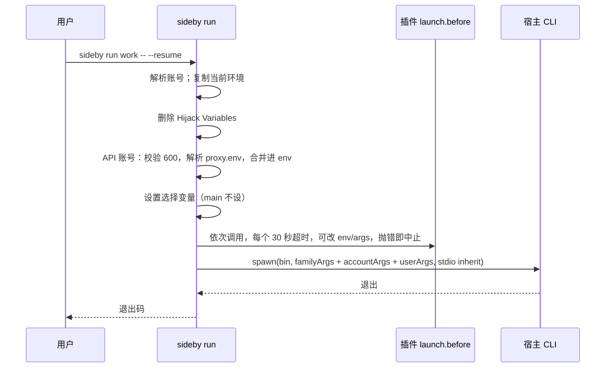

# sideby v0.1 设计

日期：2026-10-05 · 状态：已按 Codex 审核修订（§9） · 术语见 `CONTEXT.md` · 决策见 `docs/adr/`

## 1 目标

让同时持有多个 AI coding 账号的人，在终端里把它们**并排**跑起来，做到四点：不串号；skills、hooks、规则只维护一份；坏了一条命令修好；每个账号的额度和用量一屏看完。

一句话定位：**Run every AI coding account side by side.**

### 1.1 用户与场景

| 用户 | 典型账号组合 | 今天的痛点（证据） |
|---|---|---|
| cc-switch / magpie 用户，想同时开多个账号 | 1 个 Claude 订阅 + DeepSeek/GLM key + 中转 | 切换会改全局配置，同一时间只有一个生效（cc-switch #1105、#1106、#2908） |
| 工作号和个人号分开用 | 2 个 Claude 订阅、2 个 ChatGPT 号 | 手工维护 `CLAUDE_CONFIG_DIR` 和 symlink，时间一长就漂移 |
| 多个 CLI 一起用 | Claude Code + Codex + Grok + pi | 每家的目录约定和坑都不一样 |

### 1.2 体验原则

- **什么都不用额外装。** 只要有 Node 和宿主 CLI 就能用。用量由 sideby 直接读宿主的本地记录。
- **没有数据时要说清楚原因。** 是「还没开过会话」「这个宿主没有公开来源」，还是「格式变了」，每种情况分开提示。
- **每条错误都告诉用户下一步怎么做。** 错误信息里只出现路径和变量名，永不出现凭据的值。

### 1.3 成功标准

- 只装了 `~/.claude` 的新用户，从 `npx sideby` 开始，3 条命令以内让第二个账号并排跑起来。
- 维护者原有的自制多账号脚本，其全部行为在 sideby 里都有对应测试（对照表留在维护者本机，不入库）。
- README 首图是面板截图，显示多个账号的额度。

## 2 范围

### 2.1 v0.1 做

- 四个内置家族：claude、codex、grok、pi，全部以插件形式实现。
- CLI：`list`、`run`、`new`、`login`、`doctor`、`quota`、`ui`、`shell-init`、`plugins`、`quota setup|teardown claude`。
- 本地插件：Family Plugin，以及 `launch.before`、`account.created`、`doctor.check` 三类 Hook。
- 面板：账号卡片（额度、用量、健康）、体检加一键修复、新建账号。由 `createPanelHandler` 提供，`sideby ui` 独立运行。
- 额度：Claude 订阅读 statusline 缓存，Codex 读本地 rollout。
- 用量：内置读取 Claude 和 Codex 的本地会话记录，不依赖任何外部工具。
- AI 配套：`AGENTS.md`、`CLAUDE.md` 链接、`--json` 加 JSON Schema、可安装 skill、`llms.txt`。
- 发布：CI 加 tag 触发的 trusted publishing workflow（就绪，但本轮不推送、不发布）。
- 平台：macOS、Linux。

### 2.2 v0.1 不做

| 不做 | 原因 | 何时再议 |
|---|---|---|
| 全局切换、订阅轮换、凭据代理 | ADR-0001 | 不再议 |
| 调用逆向额度接口 | ADR-0003 | 第三方插件可以自行实现 |
| Grok、pi 的额度和用量 | 没有公开或稳定的本地来源 | 宿主提供来源后 |
| cursor 家族 | 只有一个 file-store 槽位，同时用多个号可能被封 | v0.2 |
| 面板里「在终端打开」 | 每种终端的做法不同 | v0.2 |
| 从 npm 安装插件 | 等于运行第三方代码 | 有真实需求再议 |
| 单文件二进制、Homebrew tap | ADR-0002 第二阶段 | Node 成为门槛时 |
| Windows、MCP server、定时体检 | 见 ADR 和 grilling 记录 | 不计划，或 v0.2 再议 |

## 3 架构

### 3.1 仓库与构建

```
sideby/
├── AGENTS.md · CLAUDE.md（内容为 `@AGENTS.md`）· CONTEXT.md · README.md · README.zh-CN.md · llms.txt
├── docs/{adr,specs,plans,verification}/
├── schemas/                  # 由 TypeBox 定义生成的 JSON Schema
├── skills/sideby/SKILL.md
├── src/
│   ├── cli/                  # 参数解析和各子命令（只做 I/O）
│   ├── core/                 # 路径、配置、账号发现、Secret File、Share Mode、doctor、launch、原子写入
│   ├── plugins/              # 加载器、信任校验、事件总线
│   ├── families/{claude,codex,grok,pi}/
│   ├── quota/                # Claude statusline 缓存，Codex rollout 读取
│   ├── panel/                # createPanelHandler 和内联页面
│   └── index.ts              # 库入口：createPanelHandler 和插件类型
├── testing/                  # 假 HOME、假宿主 bin、插件测试工具
├── .github/workflows/{ci,release}.yml
└── scripts/leak-check.sh
```

- **构建**：源码是 `.ts`，用 `tsc` 编译到 `dist/`，开启 `rewriteRelativeImportExtensions`。原因是 Node 拒绝对 `node_modules` 里的 `.ts` 做类型剥离（本机 Node 22.22.3 实测报 `ERR_UNSUPPORTED_NODE_MODULES_TYPE_STRIPPING`）。用户的插件在 `node_modules` 之外，可以直接写 `.ts`。
- **开发和测试**：直接用 `node --test` 跑 `.ts`，不需要先构建。
- **依赖**：运行时只有 `typebox`；开发时有 `typescript`、`@biomejs/biome`、`@types/node`。
- **启动检查**：Node 低于 22.18 时，打印升级提示并以 1 退出。

### 3.2 账号模型

| 家族 | Main Account | 其他 Account | 选择变量 | 宿主命令 |
|---|---|---|---|---|
| claude | `~/.claude` | `~/.claude-<name>` | `CLAUDE_CONFIG_DIR` | `claude` |
| codex | `~/.codex` | `~/.codex-<name>` | `CODEX_HOME` | `codex` |
| grok | `~/.grok` | `~/.grok-<name>` | `GROK_HOME` | `grok` |
| pi | `~/.pi/agent` | `~/.pi-<name>/agent` | `PI_CODING_AGENT_DIR` | `pi` |

- 账号名 `<name>` 必须匹配 `^[a-z0-9][a-z0-9-]{0,31}$`。现有的 `004` 本身就是合法名字。
- 账号靠通配发现。不符合命名规则的目录、config 里 `ignore` 的目录，以及非目录项，都不算账号。
- 名字符合规则的目录，还必须满足以下之一才算账号：有 `proxy.env`；至少有一个该家族的共享项；或者是空目录（刚建好）。这样能排除别的工具的配置目录，例如 claude-code-router 的 `~/.claude-code-router`。名字看起来像备份（含 `bak`、`backup`、`old`、`tmp`）时，doctor 给一条 warn，建议加进 `ignore`。
- Main Account 的名字固定为 `main`，启动时不设选择变量。不做「某个编号就是主目录」这类特殊映射；需要旧习惯的用户用 config 的 `aliases`（例如 `codex001 → codex:main`）。
- **引用账号**：写 `<family>:<name>`。名字在所有家族里唯一时，可以只写 `<name>`；有歧义就报错，并列出候选。

**API 账号**：账号目录里有 `proxy.env`。

- 解析规则是 dotenv 子集：`KEY=VALUE`、可选的 `export ` 前缀、单引号或双引号、`#` 注释。不经过 shell，所以不支持命令替换和变量展开。
- 解析出错时报出行号，不报内容。权限不是 600 时拒绝启动，并提示 `chmod 600 <path>`。

### 3.3 Share Mode

| Mode | 健康 | `--fix` | 绝不做 |
|---|---|---|---|
| `link` | 是 symlink，解析后指向主目录对应项 | 缺失时补 link | 位置上是真文件或真目录时，只报告，并给出 `mv <x> <x>.local && ln -s …` |
| `copy` | 是真文件或真目录，内容与主目录一致 | 缺失或过期时复制；是指向主目录的 symlink 时，先删 link 再复制 | 永远不通过 symlink 写到主目录；类型不一致时不动 |
| `link-or-copy` | symlink，或内容一致的副本 | 副本过期时镜像主目录 | 主目录为空或类型不一致时不动 |
| `link-or-local` | symlink，或任意真文件 | 缺失时补 link | 不比较内容，不覆盖 |
| `local` | 是真文件，不比较内容 | 缺失时从主目录复制一份 | 是 symlink 时只报告 |
| `local-if-api` | 订阅账号按 `link-or-copy` 判断；API 账号必须是自己的真文件 | 只修订阅账号 | API 账号的 symlink 或缺失，只报告 |
| `info` | 不计数 | 不处理 | — |
| `json-key` | 账号自己文件里的某个 JSON 键，与主文件一致 | 只替换这一个键；写入前后比较文件 hash，期间文件被改动就放弃 | 会让账号已有条目减少（包括清空）时，没有 `--force` 就拒绝；文件是 symlink、不是 JSON 对象、该键不是对象时，`--force` 也拒绝 |

通用规则（与旧实现一致，逐条有测试）：

- 主目录里没有的项：没什么可共享，不报告、不计入分母、不自动创建（2026-10-05 面板验收后调整：多数用户没有 `commands`、`themes` 这类目录，报 warn 只是噪音）。
- symlink 永不改指向，分三种情况：
  - 悬空链接：报 fail。
  - 指向别处但目标存在：允许链接的项报 warn（用户有意为之）；宿主不允许链接的项（`copy`、`local`、`noSymlink`）报 fail。
  - 相对路径的链接只要解析后等价，就算健康。
- 共享项路径必须是相对路径，不能含 `..`。每次修复在执行的那一刻都会校验写入位置：解析父目录的真实路径后，必须仍在账号目录内，父目录是指向别处的链接时拒绝。
- 复制时递归处理，保留权限位和隐藏文件，目录里的 symlink 原样复制为 symlink。
- 所有写入先写同目录的临时文件（权限 600），再 rename；凭据文件写完后 chmod 600。
- 条件写入（`json-key`、statusline teardown）会在写入前、以及 rename 前各核对一次 hash。普通文件做不到真正的比较并交换，这只是把和宿主同时写同一个文件的冲突窗口缩到最小。
- 已知限制：写入位置的校验和真正写入之间仍有极短的时间窗，期间父目录理论上可能被换成链接。Node 没有按目录句柄写入的 API（如 `openat`），无法彻底消除；能利用这个窗口的进程本身已经能直接改用户 HOME 下的这些文件，所以不构成新的越权。
- 已知取舍：名字符合规则的空目录会被当作刚建好的账号，偶尔会把无关的同名空目录列出来，用户可以把它加进 `ignore`。
- statusline 的 diff 只展示 `statusLine` 这一个对象的前后变化，`settings.json` 其余内容（常含 `env` 里的 API key）永远不进 diff。
- 凭据文件解析失败时，错误信息不引用文件内容（Node 的 `JSON.parse` 报错会带出输入片段）。
- 凭据文件（`proxy.env`、`.claude.json`、`auth.json`）只检查类型和权限是否为 600，`--fix` 会改回 600。内容只读 `json-key` 指定的那一个键。
- 备份残留（深度 1 下的 `*.bak*`、`*backup*`、`*.tmp*`）只计数，不处理。

### 3.4 内置家族

经过测试的版本：Claude Code 2.1.289、codex-cli 0.160.0、grok 1.0.46、pi 1.0.2（2026-10-05 在维护者本机）。

| 家族 | Hijack Variables | 共享项（Mode） | 登录命令 | 登录态判断（不联网、不读凭据值） |
|---|---|---|---|---|
| claude | `ANTHROPIC_{API_KEY,AUTH_TOKEN,BASE_URL,MODEL,SMALL_FAST_MODEL,DEFAULT_HAIKU_MODEL,DEFAULT_SONNET_MODEL,DEFAULT_OPUS_MODEL}` | `settings.json`、`settings.local.json`、`skills`、`commands`、`plugins`、`hooks`、`themes`、`CLAUDE.md`（link）；`.claude.json#mcpServers`（json-key） | `claude auth login`（已核实） | 账号的 `.claude.json` 里有 `oauthAccount` 键 |
| codex | `OPENAI_API_KEY`、`OPENAI_BASE_URL`、`CODEX_API_BASE_URL` | `AGENTS.md`、`hooks.json`、`plugins`、`rules`、`skills`（link）；`config.toml`（local-if-api） | `codex login`（已核实） | `auth.json` 存在 |
| grok | `XAI_API_KEY`、`GROK_MODELS_BASE_URL` | `skills`、`installed-plugins`（link）；`hooks`、`hooks-paths`（copy）；`trusted_folders.toml`（local）；`config.toml`（local-if-api，订阅账号在 Grok 下按 copy 判断）；`auth.json`（info，但它是 symlink 时 fail） | `grok login`（已核实） | `auth.json` 是真文件 |
| pi | `ANTHROPIC_API_KEY`、`ANTHROPIC_AUTH_TOKEN`、`ANTHROPIC_BASE_URL`、`OPENAI_API_KEY`、`OPENAI_BASE_URL` | `AGENTS.md`（link） | 进入 pi 后执行 `/login` | `auth.json` 存在 |

其他约束：

- **codex**：非 main 账号默认加 `-c cli_auth_credentials_store="file"`，用户参数里已经有这个键时不加。
- **grok**：hooks 等路径在沙箱里不允许 symlink，doctor 的提示会引用宿主原话。
- **pi**：账号目录多一层 `agent/`；pi 专属的模板复制等工作交给 pi 侧的插件（通过 `account.created`、`doctor.check`）。
- **个人项**：`statusline-command.sh`、`scripts` 这类属于个人的共享项不进内置清单，用户可在 config 的 `extraSharedItems` 里自己加。
- **宿主未安装**：`list` 照常列出账号，只给该家族标「宿主未安装」；`run` 报错，并给出官方安装文档的链接。

### 3.5 启动



- **参数顺序**：家族默认参数 → config 里该账号的 `args` → `--` 之后的用户参数。
- **父 shell**：环境永不修改。
- **信号**（macOS 和 Linux）：
  - 子进程运行期间，sideby 忽略 `SIGINT`、`SIGQUIT`。终端会把它们直接发给前台进程组，宿主照常能收到。
  - `SIGTSTP`（Ctrl-Z）保持默认动作：sideby 和宿主一起暂停，`fg` 时一起恢复。（OCR 审查发现：如果忽略它，就只有宿主被暂停，shell 会一直等 sideby。）
  - `SIGTERM`、`SIGHUP` 转发给子进程一次，之后等它退出。
  - 窗口大小变化不用处理，宿主共享同一个 TTY。
  - 子进程退出后，sideby 移除所有监听，不再转发。
- **退出码**：子进程正常退出时，原样返回它的退出码；子进程被信号终止时，返回 `128 + 信号编号`。sideby 自身出错返回 1，用法错误返回 2。
- **危险参数**：不再默认带任何危险参数。旧实现硬编码的 `--dangerously-skip-permissions`，改由 config 给单个账号显式配置。
- **登录**：`sideby login <account>` 用同样的环境运行该家族的登录命令。
- **shell-init**：`sideby shell-init zsh|bash` 输出 shell 函数，包括 config 里 `aliases` 定义的短名（例如 `cc004`）。

### 3.6 插件

**插件等同于本地任意代码**，拥有 sideby 进程的全部权限。README 和 `sideby plugins` 都要写明这一点。

```
my-plugin/
├── plugin.json      # name、version、description、userConfig（带类型的配置项）
├── index.ts         # export default { name, register(api) {…} } satisfies Plugin
└── index.test.ts    # 用 sideby/testing 测试
```

```ts
import type { Plugin } from 'sideby'   // 只允许 import type（ADR-0002）

export default {
  name: 'litellm-gateway',
  register(api) {
    api.on('launch.before', { family: 'claude' }, async (ctx) => {
      // ctx.account、ctx.env（可改）、ctx.args（可改）、ctx.config
      // 网关没起来时：throw api.abort('网关没起来：…')
    })
  },
} satisfies Plugin
```

| 扩展点 | 时机 | 能做什么 | 超时 |
|---|---|---|---|
| `api.family(def)` | 加载插件时 | 注册家族：目录约定、选择变量、Hijack Variables、默认参数、共享项、登录命令、登录态判断、模型、可选的 `readQuota`、`readUsage` | — |
| `launch.before` | 每次 `run`、`login` 之前 | 改 env 和 args，或中止 | 30 秒 |
| `account.created` | `new` 成功后 | 补文件，打印下一步提示 | 30 秒 |
| `doctor.check` | 检查每个账号时 | 返回 Finding，可附 `fix()` | 10 秒 |

**加载与信任**：

- 加载顺序：内置插件 → `~/.config/sideby/plugins/*` → config 里 `pluginDirs` 列出的路径。`pluginDirs` 只接受绝对路径或以 `~` 开头的路径。
- 加载前校验：插件目录和入口文件必须属于当前用户，且不能被组或其他用户写。不满足就拒绝加载，并说明原因。
- 同名插件，后加载的报冲突，不会覆盖先加载的。
- 插件出错时：错误信息标明插件名。加载失败只影响它自己；`doctor.check` 出错转成该账号的一条 fail Finding；`launch.before` 出错就中止启动。
- sideby 自己的修复都会校验写入位置必须在账号目录内（§3.3）。插件的 `fix()` 和 `api.fs` 属于插件代码，sideby 管不住它写到哪里（ADR-0002：插件就是本地代码），只保证一个 fix 失败不影响其他 fix。

**内置可选插件 `account-script`**（默认关闭）：

- 账号目录里有 `sideby-before-launch` 文件时，启动前运行它。
- 运行条件：文件属于当前用户、可执行、不能被组或其他用户写。
- 工作目录是账号目录，环境是已准备好的启动环境，超时 25 秒（留在 hook 自身 30 秒上限之内，超时时能给出更具体的报错）。
- 失败就中止启动，错误信息显示它的 stderr 末尾 20 行。

### 3.7 额度与用量

| 家族 | 额度 | 用量（近 7 天 token） |
|---|---|---|
| claude 订阅 | statusline 缓存（先跑一次 `quota setup claude`） | 读 `<dir>/projects/**/*.jsonl` 里的 `message.usage`，按 `message.id` 去重 |
| codex 订阅 | 读 rollout 里的 `token_count.rate_limits` | 每个 rollout 文件按段累加 `token_count.info.total_token_usage`（累计值回落表示新的一段），再扣掉首条事件继承来的基线（subagent 会话从父线程的累计值开始） |
| grok、pi | 显示「这个宿主没有公开来源」 | 同左 |
| API 账号 | 不显示 | 同所属家族 |

**Claude statusline 缓存**：

- **setup**：先展示 diff，用户确认后，把主 `settings.json` 的 `statusLine.command` 包成 `sideby statusline-tap --orig-b64 <base64(原命令)>`（base64 保证原命令的引号和空格不被 shell 二次拆分）。同时在 state 目录记录三样东西：原始字节、原始 hash、包装后的 hash。重复 setup 时检测到已包装，直接提示已开启。
- **teardown**：只有当前文件的 hash 仍等于包装后的 hash 时，才把原始字节原样写回。否则拒绝，给出 diff，并说明「文件在开启后被改过，请手动把 `statusLine.command` 改回原命令」。
- **statusline-tap**：
  - 读 stdin 的 JSON，取 `rate_limits`，写入 `${XDG_STATE_HOME:-~/.local/state}/sideby/quota/claude/<name>.json`。账号由 `CLAUDE_CONFIG_DIR` 反推，没有这个变量就是 `main`。
  - 再把原始 stdin 交给原命令，透传它的 stdout 和退出码。原来没有 statusline 时，输出一行默认内容。
  - 任何解析错误都不能影响透传。
  - 用一个单独的小入口，只 import 最少的模块。
- **自己有一份 `settings.json` 的账号**（不是 link）：面板提示「这个账号的 settings.json 不共享，额度需要单独开启」。

**Codex rollout 读取**：

- 按文件修改时间从新到旧扫描，最多看 20 个文件。
- 每个文件逐行解析，坏行跳过。
- 只接受结构完整的 `rate_limits`：`used_percent` 是数字，`window_minutes` 是正数，`resets_at` 是秒。
- 按事件里的 `timestamp` 取最新的一条。窗口按 `window_minutes` 归类：300 是 5h，10080 是 7d，其他值原样显示。
- 结果里记录来源文件和事件时间。

**显示规则**：

- 每个额度都标注数据时间，例如「5h 已用 42%，14:30 重置，12 分钟前的数据」。
- 已过 `resets_at` 的窗口，显示「已重置，等下次会话更新」。
- 没有数据时，区分三种原因：未开启（Claude）、还没有会话、格式无法识别。

### 3.8 面板

- **库入口**：`createPanelHandler({ basePath, allowedHosts, readOnly?, runtime? })` 返回 `(req, res) => Promise<boolean>`。
  - `allowedHosts` 是 Host 头允许的取值，例如 `['127.0.0.1:17420', 'localhost:17420']`；嵌入门户时由门户传入自己的主机名。
  - 每个 handler 实例在内存里生成自己的随机 token，注入到它返回的页面中。
  - 写请求的 `Origin` 必须等于 `http://<请求的 Host>`，并且这个 Host 在 `allowedHosts` 里。
  - 独立运行和嵌入门户共用同一套规则，各有一个集成测试。
- **独立运行**：`sideby ui [--port]` 只监听 `127.0.0.1`，默认端口 17420。
  - 端口被另一个 sideby 面板占着：直接打开那个面板。
  - 被别的程序占用：顺延到下一个空闲端口，并打印最终地址。
  - 启动后自动打开浏览器；打不开就只打印地址。
- **页面实现**：原生 HTML、CSS、JS，全部内联，跟随系统切换深色和浅色。

**页面内容**：

| 区块 | 内容 | 空数据 | 出错 | 慢加载 |
|---|---|---|---|---|
| 账号卡片 | 家族、名字、订阅或 API、模型、登录态、5h 和 7d 额度条、近 7 天 token、健康徽标 | 没有任何账号时，显示「新建第一个账号」引导 | 单个账号读取失败，只把那张卡片标红并写明原因 | 先出骨架，额度和用量异步填充 |
| 体检 | 上次体检时间、Finding 列表、「一键修复」 | 显示「全部健康」 | 修复失败的条目逐条列原因 | 按钮显示进行中 |
| 新建账号 | 选家族、填名字、勾选是否 API 账号 | — | 名字非法或已存在时就地提示 | — |
| 额度引导条 | Claude 额度未开启时，给出「开启」按钮（展示 diff 后确认） | — | — | — |

**安全**：面板是「本机受信应用」，不防本机上的恶意进程，只防网页发起的请求。

- 只监听 `127.0.0.1`。每个请求校验 `Host` 必须在 `allowedHosts` 里，用来防 DNS rebinding。
- 写接口必须带 `x-sideby-token`（handler 实例的随机 token，只存在内存里），`Origin` 必须存在且与请求的 Host 同源。
- 请求体上限 64KB。写操作全局串行，同一时间只执行一个。
- 新建订阅账号后，面板只给出 `sideby login <account>` 的复制按钮。

**嵌入其他本地页面**：别的本地 Node 网页可以用约 10 行调用 `createPanelHandler`，把面板挂在自己的路径下。嵌入方传入自己的 `allowedHosts`，handler 负责 token 和 Origin 校验。

**只走运行时**：面板和 CLI 只通过 `src/runtime.ts` 调用。体检记录由运行时 `doctor()` 写（只读面板传 `persist: false`）；额度开启通过 `quotaSetups()` / `quotaSetup(family)`；用户造成的错误统一是 `UserError`，面板映射为 400，CLI 映射为退出码 1（2026-10-05 架构加固第 1 轮）。

### 3.9 CLI 与 JSON 契约

| 命令 | 退出码 |
|---|---|
| `sideby`（等同于 `list`） | 0 |
| `sideby run <acct> [-- args]` | 宿主的退出码；被信号终止时为 128+n；sideby 自身出错为 1 |
| `sideby new <family> <name> [--api]` | 0；名字不合法、目录已存在或部分失败为 1；缺参数为 2 |
| `sideby login <acct>` | 宿主的退出码 |
| `sideby doctor [acct\|family] [--fix] [--force]` | 0 健康；1 有问题；2 用法错误 |
| `sideby quota [acct]` | 0 |
| `sideby quota setup\|teardown claude [--yes]` | 不加 `--yes` 只展示 diff 和下一步命令；0；拒绝或失败为 1 |
| `sideby ui [--port n] [--no-open]` | — |
| `sideby shell-init zsh\|bash` | 0 |
| `sideby plugins` | 0；有加载失败的插件时为 1 |

- 退出码规则：命令行形状错误（缺参数、未知命令或选项）为 2；账号、家族不存在或操作失败为 1。
- 除 `run`、`login`、`ui`、`shell-init` 外，所有命令都支持 `--json`，输出带 `schemaVersion: 1`。 只有 `--` 之前的 `--json` 才算 sideby 的选项。`plugins --json` 只给出插件配置的键名（`configKeys`），不输出值。
- 版本规则：只新增字段时 `schemaVersion` 不变；删除字段、改名或改语义时加 1。
- 所有输出、日志、错误信息里都没有凭据值（key、token、密码）。模型名不算凭据：API 账号的 `ANTHROPIC_MODEL` 这类非密钥变量可以显示。

### 3.10 配置与状态

- **配置**：`${XDG_CONFIG_HOME:-~/.config}/sideby/config.json`，可以不存在，schema 在 `schemas/config.json`。字段：`accounts.<ref>.args`、`aliases`、`ignore`、`pluginDirs`、`plugins.<name>`（含 `enabled` 和 userConfig）、`extraSharedItems`。
- **状态**：`${XDG_STATE_HOME:-~/.local/state}/sideby/`，存放额度缓存、上次体检结果、statusline 原始备份。
- **不写宿主目录**：sideby 不往宿主账号目录写自己的文件。唯一例外是 `quota setup claude` 在用户确认后修改主 `settings.json`。

### 3.11 AI 配套

- **AGENTS.md**：写明命令、目录地图、不变量。不变量包括：§3.3 每种 Mode 的「绝不做」、不泄露凭据、不写宿主目录、插件即本地代码。
- **`pnpm check`**：依次跑 `tsc --noEmit`、biome、`node --test`、`leak-check`。任何一项失败都输出文件和修法。
- **测试隔离**：测试一律用 `testing/` 提供的假 HOME 和假宿主 bin。检测到真实 HOME 就失败。
- **测试文件**：每种 Mode、每个家族一个测试文件。
- **skill 与 llms.txt**：
  - `skills/sideby/SKILL.md` 教 agent 用 `list --json`、`doctor --json` 诊断，以及何时该让用户自己去登录。安装方式：`npx skills add Adonis0123/sideby`。
  - `llms.txt` 是命令、JSON 契约和插件 API 的索引。

### 3.12 分发与发布

- 包名 `sideby`，命令 `sideby`，`engines.node >=22.18`。`files` 只包含 `dist`、`schemas`、`skills`、README、LICENSE。
- **`ci.yml`**：触发条件是 `push` 和 `pull_request`，权限 `contents: read`。跑 `pnpm check` 和 build，并用 `npm pack --dry-run` 检查发布内容。
- **`release.yml`**：只在推送 `v*` tag 时触发。
  - `publish` job：使用 environment `npm`，权限 `contents: read` 加 `id-token: write`。不用任何 cache。action 全部固定到 commit SHA，checkout 设 `persist-credentials: false`。安装用 `pnpm install --frozen-lockfile --ignore-scripts`。先校验 tag 等于 `v<version>`，再跑测试、构建，然后 `npm publish`（npm ≥11.5.1，provenance 自动生成）。
  - `github-release` job：权限 `contents: write`，用 changelogithub 生成发布说明。它能解析 emoji 前缀的 commit。
- **首发**：npm 要求包已存在才能配置 trusted publisher，所以 0.1.0 必须在本机手动发布一次。之后按 `docs/release.md` 的清单配置 trusted publisher、关闭 token、加 tag 保护。**这一步等作者确认后再做。**
- **日常发版**：`npm version <x> -m "🔖 chore(release): v%s"`，然后 `git push --follow-tags`。

## 4 从自制脚本迁移

已经用自制脚本管理多账号的用户，按下表迁移：

| 自制脚本里的做法 | sideby 里的对应 |
|---|---|
| 一个账号一个短命令（`cc004`） | config 的 `aliases`，由 `sideby shell-init` 生成 |
| 启动前先拉起本地网关的脚本 | 开启 `account-script`，脚本改名为 `<账号目录>/sideby-before-launch` |
| 自定义的体检或提醒 | 写成本地插件（`doctor.check`、`account.created`） |
| 定时跑的体检 | 定时任务改为调用 `sideby doctor --fix` |
| 额外共享的个人文件 | config 的 `extraSharedItems` |

建议先让新旧两套并存，确认行为一致后再删旧脚本。

## 5 验收

分两层：

- **确定性层**：`pnpm check` 全部通过。用假 HOME 加假宿主 bin 跑完下面 1–12 条。
- **真实层**：在维护者本机用真实宿主做补充验证。对真实 HOME **只读**，只跑 `list`、`doctor`（不加 `--fix`）、`quota`。

1. 只有 `~/.claude` 时运行 `sideby`：列出 `claude:main`，并提示怎么新建账号。
2. `new claude work` 之后，`run claude:work`：宿主拿到的 `CLAUDE_CONFIG_DIR` 指向新目录，劫持变量已被清除。同时 `run claude:main` 时，宿主拿到的环境里没有选择变量。两个账号用真实订阅同时登录，属于人工补充项。
3. `new claude deepseek --api`：生成权限 600 的 `proxy.env` 模板。填好后，宿主拿到注入的变量；父进程环境不变。权限改成 644 后拒绝启动，并给出修法。语法错误时报出行号。
4. Grok 的 `hooks` 是 symlink：doctor 报 fail，`--fix` 后变成真目录，内容和主目录一致。
5. `link` 位置上是真文件：`--fix` 不替换它，只给出处理命令。§3.3 的每个「绝不做」都有测试。
6. `json-key`：新增 server 能同步过去；会删除已有 server 时，不加 `--force` 拒绝；`.claude.json` 是 symlink 时，加 `--force` 也拒绝。
7. statusline：setup 之后用一段样例 stdin 跑 tap，缓存写入、原命令输出原样透传。用户改过文件后 teardown 拒绝；没改过时 teardown 恢复后，文件和原来逐字节一致。
8. Codex 额度：多个文件、乱序、截断、坏行的 fixture 都取到正确的最新值。维护者本机真实读取的结果，和 rollout 里最新一条一致。
9. 面板：空数据、单卡出错、慢加载、正常四种状态都截图存档；一键修复和新建账号走完真实流程。
10. 面板安全：错误的 Host、缺少 Origin、跨源 Origin、缺少或错误的 token、超大请求体，全部被拒绝。
11. 启动：子进程以 3 退出时 sideby 也返回 3；子进程被 SIGTERM 终止时返回 143；`launch.before` 插件抛错时宿主不启动，错误里有插件名；插件目录可被他人写时拒绝加载。
12. 首日错误路径：宿主未安装、端口被占、插件加载失败、账号名有歧义，每种都给出可执行的下一步。

## 6 风险

| 风险 | 应对 |
|---|---|
| 宿主改目录布局或沙箱规则 | 家族知识集中在各自插件里；修复只做 §3.3 列出的动作；README 写明经过测试的版本 |
| Codex rollout 格式变化 | 解析失败显示「格式无法识别」；fixture 取自真实样例 |
| statusline 每次刷新都多一次 Node 冷启动 | tap 用单独的最小入口；验收时实测耗时并写进 verification |
| 包装 statusline 后和用户自己的配置冲突 | 解析失败也透传；teardown 有 hash 保护 |
| 通配把备份目录当成账号 | 命名规则加 `ignore`，像备份的名字给 warn |
| 条款变化 | ADR-0001、ADR-0003 的「不做」写进 README FAQ |
| 同类项目（aimux、agenv） | README 首屏突出额度面板、Grok 和 pi 支持、doctor、插件 |

## 7 待作者确认（实现时先按这里的默认值做）

1. 支持具名账号，编号只是名字恰好是数字。
2. 中心配置放 `~/.config/sideby/config.json`，账号目录里不写 sideby 的任何文件。
3. Claude 额度需要用户执行一次 `quota setup claude` 显式开启；面板上也有开启按钮。
4. 用量由 sideby 内置读取，不依赖 ccusage（作者 2026-10-05 要求）。
5. 公开文档用英文，README 另配中文版；spec 和 plan 用中文。
6. 面板默认端口 17420，被占用时顺延。
7. 首次 push、创建 GitHub 仓库、npm 首发，都等作者单独确认。

## 8 对本仓之外的依赖

宿主 CLI（版本见 §3.4）、Node ≥22.18、GitHub Actions、npm registry。

## 9 审核记录

**2026-10-05 Codex 只读咨询**（记录在 `.review-handoff/runtime/consults/`，未纳入 git）。采纳与否如下：

| 意见 | 结论 |
|---|---|
| 启动信号和退出码没定义 | 采纳，见 §3.5 |
| 插件等同本地代码，应有信任校验 | 采纳，见 §3.6 |
| statusline teardown 会覆盖用户后来的修改 | 采纳，加 hash 保护，见 §3.7 |
| 面板只靠固定请求头不够 | 采纳，改用随机 token，加 Host 校验和大小限制，见 §3.8 |
| 宿主事实未验证 | 采纳，已在本机核实，并写明版本，见 §3.4；Claude 的 `rate_limits` 仍以官方文档为依据，等验收第 7 条用真实会话补实测 |
| Codex rollout 读取不够稳 | 采纳，见 §3.7 |
| Grok 的 `trusted_folders` 模式写得矛盾 | 采纳，改为 `local` |
| codex 的 file-store 参数会覆盖用户设置 | 采纳，用户参数里已有就不加 |
| `json-key` 的删除和并发语义不清 | 采纳，见 §3.3 |
| 验收（2026-10-05 第二轮）：凭据解析报错会带出原文、父目录链接可能让写入逃出账号目录、条件写入有时间窗、`json-key` 把 null 当成缺键、插件注册失败仍有残留、空的新账号发现不到、宿主不允许的链接只报 warn、teardown 缺 schema | 全部采纳，见 §3.2、§3.3，回归测试在 `src/core/safety.test.ts` |
| 架构加固（2026-10-05，architecture-hardening-loop，3 轮，每轮 Grok 事前咨询 + 审查—修复—复审至 PASS） | 第 1 轮：体检记录、额度开启、版本号、用户错误统一收进运行时；第 2 轮：Claude 额度缓存单一模块、额度阈值与用量天数统一（85%/60%，7 天）、额度开启抛错规则收进运行时；第 3 轮：账号对象与 Secret File 规则各只有一处、体检记录按账号合并（只查一个账号不会让别的账号显示 Healthy）、面板路由自行声明是否写入（默认禁止）、CLI 额度提示只在 setup 能修好时出现。复审额外修复：非 main 账号目录必须是真目录、建号时中间层不能是链接、插件入口不能指到插件目录外、原子写先改权限再替换、面板刷新排队 |
| 建议砍掉 Grok、pi 和面板写操作 | 不采纳。范围是作者在 grilling 中定的；工期按 agent 执行速度估算 |
| `settings.json` 整份 link 可能带入账号私有设置 | 不采纳。沿用作者现有做法，账号私有设置写在 `settings.local.json` 不共享的场景，留到 v0.2 再议 |
